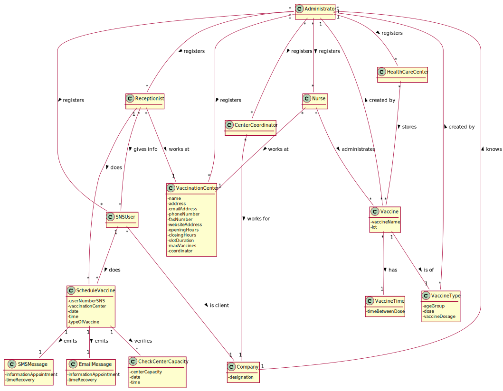

# OO Analysis #

The construction process of the domain model is based on the client specifications, especially the nouns (for _concepts_) and verbs (for _relations_) used. 

## Rationale to identify domain conceptual classes ##
To identify domain conceptual classes, start by making a list of candidate conceptual classes inspired by the list of categories suggested in the book "Applying UML and Patterns: An Introduction to Object-Oriented Analysis and Design and Iterative Development". 

### _Conceptual Class Category List_ ###

**Business Transactions**

* Scheduling
* RegisteringVaccine

---

**Transaction Line Items**

* ScheduleInformation
* VaccineSpecification
* PlaceTimeVaccination

---

**Product/Service related to a Transaction or Transaction Line Item**

* Vaccine
* AdministeringTheVaccine
* Scheduling

---

**Transaction Records**

* OrderOfVaccination
---  

**Roles of People or Organizations**

* Administrator 
* Nurse 
* Receptionist
* CenterCoordinator
* SNSUser

---

**Places**

* VaccinationCenter
* HealthcareCenter

---

** Noteworthy Events**

* VaccineCertificateEmission

---

**Physical Objects**

* Vaccine
    
---

**Descriptions of Things**

* ScheduleDescription
* VaccineSpecification
* SNSIdentity
* VaccinationCenterInfo

---

**Catalogs**

* VaccineCatalog

---

**Containers**

* HealthcareCenter
* VaccinationCenter

---

**Elements of Containers**

* Vaccine

---

**Organizations**

*  DGS

---

**Other External/Collaborating Systems**

*  

---

**Records of finance, work, contracts, legal matters**

* 

---

**Financial Instruments**

*  

---

**Documents mentioned/used to perform some work/**

* 
---

###**Rationale to identify associations between conceptual classes**###

An association is a relationship between instances of objects that indicates a relevant connection and that is worth of remembering, or it is derivable from the List of Common Associations: 

+ **_A_** is physically or logically part of **_B_**
+ **_A_** is physically or logically contained in/on **_B_**
+ **_A_** is a description for **_B_**
+ **_A_** known/logged/recorded/reported/captured in **_B_**
+ **_A_** uses or manages or owns **_B_**
+ **_A_** is related with a transaction (item) of **_B_**
+ etc.

| Concept (A) 		        |                                                       Association   	                                                       |                                                                                                                              Concept (B) |
|-----------------------|:---------------------------------------------------------------------------------------------------------------------------:|-----------------------------------------------------------------------------------------------------------------------------------------:|
| Admin  	              | -registers -registers -registers -registers -registers -registers -configures -works for   		 	 |   -nurses -vaccination centers -receptionists -vaccines -vaccine types -SNS users -core app information -DGS |
| Center Coordinator  	 |                                           -monitors -monitors -works for                                            |                                                                             -vacination process -healthcare cneter activity -DGS |
| Nurse	                |     -registers -has -schedules -emits -works for                                                  		 	      | -type, lot and number of vaccine used -acess to all of the user's health data -vaccination -vaccination certificate -DGS |
| User	                 |                                         -registers -schedules -recieves		 	                                         |                                                        -their personal data vaccination vaccination certificate by e-mail or sms |
| Receptionist 	        |                                                 -confirms -asks    		 	                                                 |                                                                                   -vaccination scheduling -SNS user for their number |

## Domain Model

**Do NOT forget to identify concepts atributes too.**

**Insert below the Domain Model Diagram in a SVG format**

