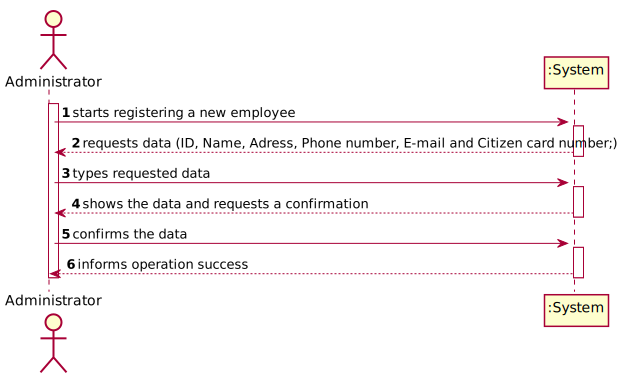
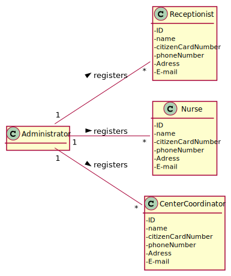
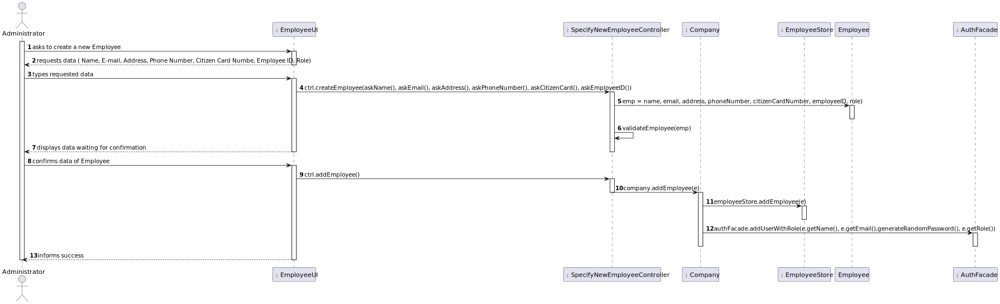
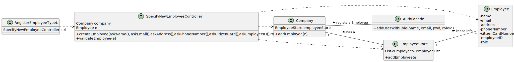

# US 010 - Administrator

## 1. Requirements Engineering

### 1.1. User Story Description

*As an Administrator, I want to register an Employee.*

### 1.2. Customer Specifications and Clarifications 

* Employees are divided in three types: Nurses, Receptionists and Center Coordinators;
* Employee information is composed by: ID, Name, Adress, Phone number, E-mail and Citizen card number;
* User ID should be generated automatically when an ew user is registered
### 1.3. Acceptance Criteria

* Each user must have a single role defined in the system;
* The "auth" component available on the repository must be reused;

### 1.4. Found out Dependencies

*No dependencies were found.*

### 1.5 Input and Output Data

**Input Data:**
* Typed Data:
    * Name
    * E-mail
    * Address
    * Phone Number
    * Citizen Card Number
    * Employee ID
    * Role
* Selected Data: password(generated)

**Output Data:**
* (In)Success of the operation
* Confirmation of Employee registration(Employee data)

### 1.6. System Sequence Diagram (SSD)

*Insert here a SSD depicting the envisioned Actor-System interactions and throughout which data is inputted and outputted to fulfill the requirement. All interactions must be numbered.*

### 1.7 Other Relevant Remarks

N/a

## 2. OO Analysis

### 2.1. Relevant Domain Model Excerpt 

### 2.2. Other Remarks

N/a

## 3. Design - User Story Realization 

### 3.1. Rationale

**The rationale grounds on the SSD interactions and the identified input/output data.**

| Interaction ID | Question: Which class is responsible for...                       | Answer                       | Justification (with patterns)                                                                                                                                                                         |
|:---------------|:------------------------------------------------------------------|:-----------------------------|:------------------------------------------------------------------------------------------------------------------------------------------------------------------------------------------------------|
| Step 1  		     | asking the data to the Administrator?                             | RegisterEmployeeUi           | The UI will interact with the Administrator and ask the data through functions with the help of the given class Utils.                                                                                |
| Step 2  		     | creating an Employee instance?                                    | SpecifyNewEmployeeController | The controller will instantiate a Employee which will self verify through exceptions that will be catched(related to the Name, E-mail, Address, Phone Number, Citizen Card Number, Employee ID, Role) |
| Step 3  		     | validating the Employee instance?                                 | SpecifyNewEmployeeController | The controller will validate the Employee in a boolean function that will verify if the Employee exists in the System or if it is null.                                                               |
| Step 4  		     | displaying the info to the Administrator in order to confirm it?	 | RegisterEmployeeUi           | Will get the info from the controller in order to display it to the Administrator for him to confirm.                                                                                                 |
| Step 5  		     | calling the controller for it to transport its info and save it?	 | RegisterEmployeeUi           | The UI will call its controller in order for it to transport its info into the Company, to then store it in the store(future).                                                                        |
| Step 6  		     | receiving the controller info in order to store it?               | Company                      | The Company Class will receive the controller info in order to save it into the correspondent store.                                                                                                  |              
| Step 7  		     | saving the Employee?	                                             | EmployeeStore                | It has an arrayList of Employees and has an add method which will store the Employee into the List.                                                                                                   |
| Step 8  		     | turning the Employee into a System User?                          | AuthFacade                   | It has a function called addUserWithRole which will store the Employee name, email and generate a password, while giving it the Employee System role.                                                 |

### Systematization ##

According to the taken rationale, the conceptual classes promoted to software classes are: 

 * Employee
 * EmployeeStore
 * Class3

Other software classes (i.e. Pure Fabrication) identified: 
 * RegisterEmployeeUI  
 * SpecifyNewEmployeeControllerController

## 3.2. Sequence Diagram (SD)

*In this section, it is suggested to present an UML dynamic view stating the sequence of domain related software objects' interactions that allows to fulfill the requirement.* 

## 3.3. Class Diagram (CD)

*In this section, it is suggested to present an UML static view representing the main domain related software classes that are involved in fulfilling the requirement as well as and their relations, attributes and methods.*

# 4. Tests 
*In this section, it is suggested to systematize how the tests were designed to allow a correct measurement of requirements fulfilling.* 

**_DO NOT COPY ALL DEVELOPED TESTS HERE_**

**Test 1:** Check that it is not possible to create an instance of the Example class with null values. 

	@Test(expected = IllegalArgumentException.class)
		public void ensureNullIsNotAllowed() {
		Exemplo instance = new Exemplo(null, null);
	}

*It is also recommended to organize this content by subsections.* 

# 5. Construction (Implementation)

*In this section, it is suggested to provide, if necessary, some evidence that the construction/implementation is in accordance with the previously carried out design. Furthermore, it is recommeded to mention/describe the existence of other relevant (e.g. configuration) files and highlight relevant commits.*

*It is also recommended to organize this content by subsections.* 

# 6. Integration and Demo 

*In this section, it is suggested to describe the efforts made to integrate this functionality with the other features of the system.*

# 7. Observations

*In this section, it is suggested to present a critical perspective on the developed work, pointing, for example, to other alternatives and or future related work.*

