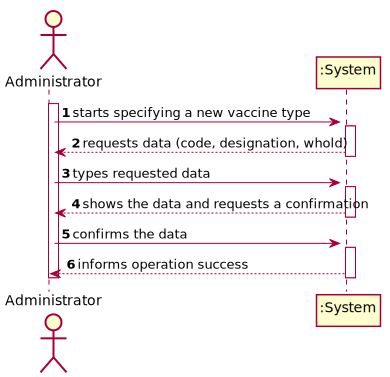
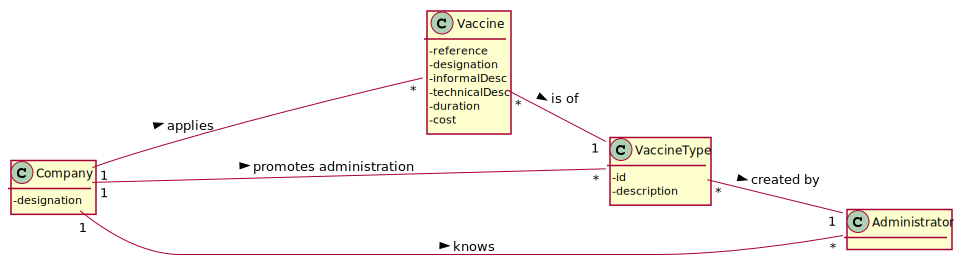

# US 012 - Administrator

## 1. Requirements Engineering
### 1.1. User Story Description

*As an administrator, I intend to specify a new vaccine type.*

### 1.2. Customer Specifications and Clarifications 

  **From the Specifications Document:**
 

> - *“[…] the community mass vaccination centers are facilities specifically created to administer vaccines of a single type […]”*
> - *“[…] healthcare center […] can administer any type of vaccines (e.g.: Covid-19, Dengue, Tetanus, smallpox).”*
> - *“[…] for each type of vaccine, it might exist several vaccines […]”*

  **From the client clarifications:**

> **Question:** What are the data that characterize a parameter category?
> 
> **Answer:** Simply consider a code, a designation and an WHO identifier

### 1.3. Acceptance Criteria

> -  *AC1: Code must be unique having 4 to 8 chars*
> -  *AC2: Designation cannot be empty and has, at maximum, 40 chars*
> -  *AC3: WHO identifier is not mandatory*

### 1.4. Found out Dependencies

*No dependencies were found.*

### 1.5 Input and Output Data

**Input Data:**
  * Typed Data:  
    * 
    * 
  * Selected Data: (none)

**Output Data:**
  * (In)Success of the operation
  * List of existing specified vaccine types

### 1.6. System Sequence Diagram (SSD)

*Insert here a SSD depicting the envisioned Actor-System interactions and throughout which data is inputted and outputted to fulfill the requirement. All interactions must be numbered.*

### 1.7 Other Relevant Remarks

-

## 2. OO Analysis

### 2.1. Relevant Domain Model Excerpt 

### 2.2. Other Remarks

n/a

## 3. Design - User Story Realization 

### 3.1. Rationale

**The rationale grounds on the SSD interactions and the identified input/output data.**

| Interaction ID | Question: Which class is responsible for... | Answer  | Justification (with patterns)  |
|:-------------  |:--------------------- |:------------|:---------------------------- |
| Step 1  		 |							 |             |                              |
| Step 2  		 |							 |             |                              |
| Step 3  		 |							 |             |                              |
| Step 4  		 |							 |             |                              |
| Step 5  		 |							 |             |                              |
| Step 6  		 |							 |             |                              |              
| Step 7  		 |							 |             |                              |
| Step 8  		 |							 |             |                              |
| Step 9  		 |							 |             |                              |
| Step 10  		 |							 |             |                              |  

### Systematization ##

According to the taken rationale, the conceptual classes promoted to software classes are: 

 * Class1
 * Class2
 * Class3

Other software classes (i.e. Pure Fabrication) identified: 
 * xxxxUI  
 * xxxxController

## 3.2. Sequence Diagram (SD)

*In this section, it is suggested to present an UML dynamic view stating the sequence of domain related software objects' interactions that allows to fulfill the requirement.* 

## 3.3. Class Diagram (CD)

*In this section, it is suggested to present an UML static view representing the main domain related software classes that are involved in fulfilling the requirement as well as and their relations, attributes and methods.*

# 4. Tests 
*In this section, it is suggested to systematize how the tests were designed to allow a correct measurement of requirements fulfilling.* 

**_DO NOT COPY ALL DEVELOPED TESTS HERE_**

**Test 1:** Check that it is not possible to create an instance of the Example class with null values. 

	@Test(expected = IllegalArgumentException.class)
		public void ensureNullIsNotAllowed() {
		Exemplo instance = new Exemplo(null, null);
	}

*It is also recommended to organize this content by subsections.* 

# 5. Construction (Implementation)

*In this section, it is suggested to provide, if necessary, some evidence that the construction/implementation is in accordance with the previously carried out design. Furthermore, it is recommeded to mention/describe the existence of other relevant (e.g. configuration) files and highlight relevant commits.*

*It is also recommended to organize this content by subsections.* 

# 6. Integration and Demo 

*In this section, it is suggested to describe the efforts made to integrate this functionality with the other features of the system.*

# 7. Observations

*In this section, it is suggested to present a critical perspective on the developed work, pointing, for example, to other alternatives and or future related work.*

