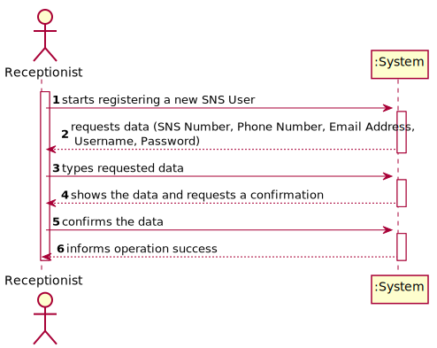
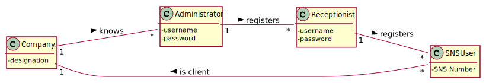
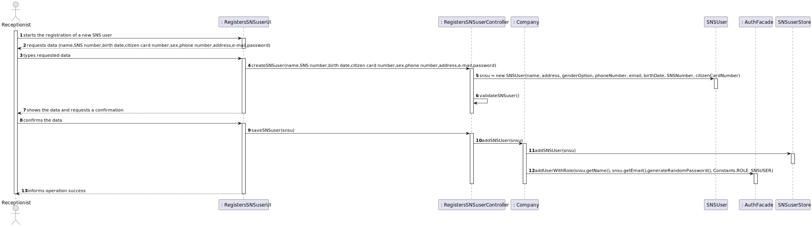
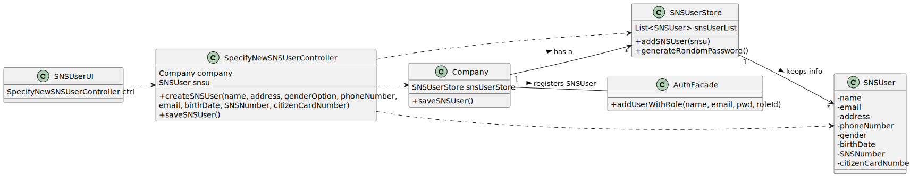

# US 003 - Receptionist

## 1. Requirements Engineering

### 1.1. User Story Description

*As a receptionist, I want to register an SNS User.*

### 1.2. Customer Specifications and Clarifications 

**From the Specifications Document:**

> Each SNS User is followed by its SNS number.

**From the client clarifications:**

> **Question: What are the necessary components in order to register an SNS User?** 
>
> **Answer: The attributes that should be used to describe a SNS user are: Name, Address, Sex, Phone Number, E-mail, Birth Date, SNS User Number and Citizen Card Number.**

### 1.3. Acceptance Criteria

 - *AC1: The SNS User must become a System User. The "auth" component available on the repository must be reused(without modifications).*
 - *AC2: The Sex attribute is optional. All other fields are required.*
 - *AC3: The E-mail, Phone Number, Citizen Card Number and SNS User Number should be unique for each SNS user.*

### 1.4. Found out Dependencies

*US10, since it is necessary for the system to have a Receptionist Menu, we need to have US10 done in order to register a Receptionist.*

### 1.5 Input and Output Data

**Input Data:**
* Typed Data:
    * Name
    * Address
    * Sex(Optional)
    * Phone Number
    * E-mail
    * Birth Date
    * SNS User Number
    * Citizen Card Number
* Selected Data: password(generated)

**Output Data:**
* (In)Success of the operation
* Confirmation of SNS User registration(SNS User data)

### 1.6. System Sequence Diagram (SSD)

### 1.7 Other Relevant Remarks

-

## 2. OO Analysis

### 2.1. Relevant Domain Model Excerpt 

### 2.2. Other Remarks

n/a

## 3. Design - User Story Realization 

### 3.1. Rationale

**The rationale grounds on the SSD interactions and the identified input/output data.**

| Interaction ID | Question: Which class is responsible for...                             | Answer                      | Justification (with patterns)                                                                                                                         |
|:---------------|:------------------------------------------------------------------------|:----------------------------|:------------------------------------------------------------------------------------------------------------------------------------------------------|
| Step 1  		     | 			requesting data?				                                                 | SNSUserUI                   | Asks attributes through functions with the help of the class Utils.                                                                                   |
| Step 2  		     | 			creating an SNS User instance?		                                     | SpecifyNewSNSUserController | Creates an Instance of an SNS User(which self verifies and sends an exception in case of invalid data).                                               |
| Step 3  		     | 			validating SNS User?				                                             | SpecifyNewSNSUserController | Returns a boolean that checks if the user is already existent or not or that it is null.                                                              |
| Step 4  		     | 			showing the info to the Receptionist in order to verify?				         | SNSUserUI                   | Gets the info from the controller in order to display it to the Receptionist.                                                                         |
| Step 5  		     | 			calling the controller for it to transport its info and save it?				 | SNSUserUI                   | After the Receptionist confirms the info, the UI is responsible to call the controller in order to pass the info into the store(future).              |
| Step 6  		     | 			receiving the controller info in order to store it?				              | Company                     | The Company class is responsible for receiving the controller info and saving it into the store.                                                      |              
| Step 7  		     | 			saving the SNS User?				                                             | SNSUserStore                | It has an arrayList of SNS Users and has an add method which will store the SNS User into the List.                                                   |
| Step 8  		     | 			turning the SNS User into a System User?				                         | AuthFacade                  | It has a function called addUserWithRole which will store the SNS User name, email and generate a password, while giving it the SNS User System role. |

### Systematization ##

According to the taken rationale, the conceptual classes promoted to software classes are: 

 * Company
 * SNSUserStore
 * SNSUser

Other software classes (i.e. Pure Fabrication) identified: 
 * SNSUserUI  
 * SpecifyNewSNSUserController

## 3.2. Sequence Diagram (SD)

*In this section, it is suggested to present an UML dynamic view stating the sequence of domain related software objects' interactions that allows to fulfill the requirement.* 

## 3.3. Class Diagram (CD)

*In this section, it is suggested to present an UML static view representing the main domain related software classes that are involved in fulfilling the requirement as well as and their relations, attributes and methods.*

# 4. Tests 
*In this section, it is suggested to systematize how the tests were designed to allow a correct measurement of requirements fulfilling.* 

**_DO NOT COPY ALL DEVELOPED TESTS HERE_**

**Test 1:** Check that it is not possible to create an instance of the Example class with null values. 

	@Test(expected = IllegalArgumentException.class)
		public void ensureNullIsNotAllowed() {
		Exemplo instance = new Exemplo(null, null);
	}

*It is also recommended to organize this content by subsections.* 

# 5. Construction (Implementation)

*In this section, it is suggested to provide, if necessary, some evidence that the construction/implementation is in accordance with the previously carried out design. Furthermore, it is recommeded to mention/describe the existence of other relevant (e.g. configuration) files and highlight relevant commits.*

*It is also recommended to organize this content by subsections.* 

# 6. Integration and Demo 

*In this section, it is suggested to describe the efforts made to integrate this functionality with the other features of the system.*

# 7. Observations

*In this section, it is suggested to present a critical perspective on the developed work, pointing, for example, to other alternatives and or future related work.*

