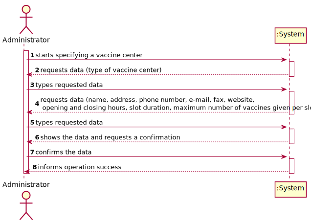
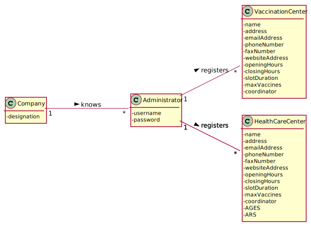

# US 009 - Administrator

## 1. Requirements Engineering

-

### 1.1. User Story Description

*As an Administrator, I want to register a vaccination center to respond to a certain pandemic.*

### 1.2. Customer Specifications and Clarifications 
**From the Specifications Document:**

>- *"[...]The main difference between the two kinds of centers is
  that a healthcare center is associated with a given ARS (Administração Regional de Saúde) and
  AGES (Agrupamentos de Centros de Saúde), and it can administer any type of vaccines[...]"*
>- *"[...]Both kinds of
  vaccination centers are characterized by a name, an address, a phone number, an e-mail address, a
  fax number, a website address, opening and closing hours, slot duration (e.g.: 5 minutes) and the
  maximum number of vaccines that can be given per slot[...]"*

**From the client clarifications:**

> **Question:** Should the system ask for the specific type of the vaccine on the creation of a Vaccination Center?

> **Question** Which field can we use as a key to validate if a given vaccination center is already registered?

> **Question** Are there any acceptance criteria for the data such as number of digits, usual of specific characters.

> **Question** Regarding each center's schedule, I would like to know if the schedule varies for each day (week day and weekend for example) or if it's the same for everyday.
I would also like to know if the slot duration and number of vaccines per slot varies by day or stays constant.

>**Question** Does the opening hour has to be a smaler number number than the closing hour (ex: opens at 8:00 and closes at 21:00), or can it also be have night hours (ex: opens at 20:00 and closes at 7:00)?

### 1.3. Acceptance Criteria

*No given Acceptance Criteria until now.*

### 1.4. Found out Dependencies

-

### 1.5 Input and Output Data

**Input Data:**
* Typed Data:
  * type of center
  * address
  * emailAddress
  * phoneNumber
  * faxNumber
  * websiteAddress
  * openingHours
  * closingHours
  * slotDuration
  * maxVaccines
  * coordinator
  * AGES
  * ARS

* Selected Data: (none)

**Output Data:**
* (In)Success of the operation
* Confirmation of vaccination center registration 
-

### 1.6. System Sequence Diagram (SSD)

*Insert here a SSD depicting the envisioned Actor-System interactions and throughout which data is inputted and outputted to fulfill the requirement. All interactions must be numbered.*

### 1.7 Other Relevant Remarks

-

## 2. OO Analysis

### 2.1. Relevant Domain Model Excerpt 
*In this section, it is suggested to present an excerpt of the domain model that is seen as relevant to fulfill this requirement.* 

### 2.2. Other Remarks

-

## 3. Design - User Story Realization 

### 3.1. Rationale

**The rationale grounds on the SSD interactions and the identified input/output data.**

| Interaction ID | Question: Which class is responsible for... | Answer  | Justification (with patterns)  |
|:-------------  |:--------------------- |:------------|:---------------------------- |
| Step 1  		 |							 |             |                              |
| Step 2  		 |							 |             |                              |
| Step 3  		 |							 |             |                              |
| Step 4  		 |							 |             |                              |
| Step 5  		 |							 |             |                              |
| Step 6  		 |							 |             |                              |              
| Step 7  		 |							 |             |                              |
| Step 8  		 |							 |             |                              |
| Step 9  		 |							 |             |                              |
| Step 10  		 |							 |             |                              |  

### Systematization ##

According to the taken rationale, the conceptual classes promoted to software classes are: 

 * Class1
 * Class2
 * Class3

Other software classes (i.e. Pure Fabrication) identified: 
 * xxxxUI  
 * xxxxController

## 3.2. Sequence Diagram (SD)

*In this section, it is suggested to present an UML dynamic view stating the sequence of domain related software objects' interactions that allows to fulfill the requirement.* 

## 3.3. Class Diagram (CD)

*In this section, it is suggested to present an UML static view representing the main domain related software classes that are involved in fulfilling the requirement as well as and their relations, attributes and methods.*

# 4. Tests 
*In this section, it is suggested to systematize how the tests were designed to allow a correct measurement of requirements fulfilling.* 

**_DO NOT COPY ALL DEVELOPED TESTS HERE_**

**Test 1:** Check that it is not possible to create an instance of the Example class with null values. 

	@Test(expected = IllegalArgumentException.class)
		public void ensureNullIsNotAllowed() {
		Exemplo instance = new Exemplo(null, null);
	}

*It is also recommended to organize this content by subsections.* 

# 5. Construction (Implementation)

*In this section, it is suggested to provide, if necessary, some evidence that the construction/implementation is in accordance with the previously carried out design. Furthermore, it is recommeded to mention/describe the existence of other relevant (e.g. configuration) files and highlight relevant commits.*

*It is also recommended to organize this content by subsections.* 

# 6. Integration and Demo 

*In this section, it is suggested to describe the efforts made to integrate this functionality with the other features of the system.*

# 7. Observations

*In this section, it is suggested to present a critical perspective on the developed work, pointing, for example, to other alternatives and or future related work.*

