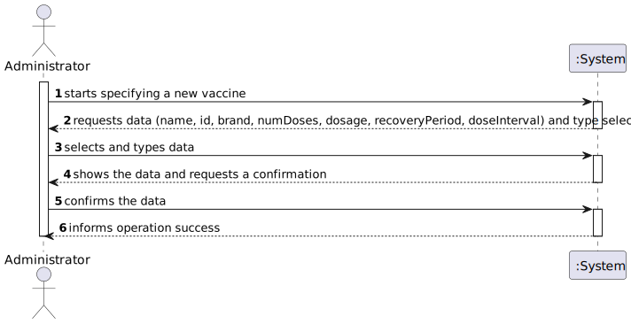

# US 013 - Specify new vaccine and its administration process

## 1. Requirements Engineering
### 1.1. User Story Description

*As an administrator, I intend to specify a new vaccine and its administration process.*

### 1.2. Customer Specifications and Clarifications

**From the Specifications Document:**

> - *“[…] . The vaccine
    administration process comprises (i) one or more age groups (e.g.: 5 to 12 years old, 13 to 18 years
    old, greater than 18 years old), and (ii) per age group, the doses to be administered (e.g.: 1, 2, 3), the
    vaccine dosage (e.g.: 30 ml), and the time interval regarding the previously administered dose.
    Regarding this, it is important to notice that between doses (e.g.: between the 1st and 2nd doses) the
    dosage to be administered might vary as well as the time interval elapsing between two consecutive
    doses (e.g.: between the 1st and 2nd doses 21 days might be required, while between the 2nd and the
    3
    rd doses 6 months might be required). […]”*

**From the client clarifications:**

> **Question:** When specifying a vaccine and its administration process, are there any rules for the attributes?
>
> **Answer:** During Sprint B I will not introduce attribute rules/formats other than the ones that I already introduced (in this forum or in the project description). Please study the concepts and define appropriate formats for the attributes.

> **Question:** When specifying a new Vaccine and its Administration Process, should a list of the existing types of vaccines be displayed in order for him to choose one, or should he just input it?
>
> **Answer:** If the information is available in the system, it is a good practice to present the information to the user and ask the user to select

> **Question:** As to the interval between doses, what time format are we to use? (e.g. days, weeks, months)
>
>  **Answer:** Number of days

### 1.3. Acceptance Criteria

### 1.4. Found out Dependencies

US012-Specify vaccine Type; there must be at least one vaccine type available in the system.

### 1.5 Input and Output Data

**Input Data:**
* Typed Data:
    * name
    * id
    * brand
    * number of doses
    * dosage
    * recoveryPeriod
    * doseInterval
* Selected Data: vaccineType

**Output Data:**
* (In)Success of the operation

### 1.6. System Sequence Diagram (SSD)

*Insert here a SSD depicting the envisioned Actor-System interactions and throughout which data is inputted and outputted to fulfill the requirement. All interactions must be numbered.*

### 1.7 Other Relevant Remarks

Should offer the option for different intervals between different doses (eg. interval between 1st and 2nd doses could be different from interval between 2nd and 3rd doses).

## 2. OO Analysis

### 2.1. Relevant Domain Model Excerpt

### 2.2. Other Remarks

n/a

## 3. Design - User Story Realization

### 3.1. Rationale

**The rationale grounds on the SSD interactions and the identified input/output data.**

| Interaction ID | Question: Which class is responsible for... | Answer  | Justification (with patterns)  |
|:-------------  |:--------------------- |:------------|:---------------------------- |
| Step 1  		 |							 |             |                              |
| Step 2  		 |							 |             |                              |
| Step 3  		 |							 |             |                              |
| Step 4  		 |							 |             |                              |
| Step 5  		 |							 |             |                              |
| Step 6  		 |							 |             |                              |              
| Step 7  		 |							 |             |                              |
| Step 8  		 |							 |             |                              |
| Step 9  		 |							 |             |                              |
| Step 10  		 |							 |             |                              |  

### Systematization ##

According to the taken rationale, the conceptual classes promoted to software classes are:

* Vaccine
* Company
* VaccineStore

Other software classes (i.e. Pure Fabrication) identified:
* NewVaccineUI
* NewVaccineController

## 3.2. Sequence Diagram (SD)

*In this section, it is suggested to present an UML dynamic view stating the sequence of domain related software objects' interactions that allows to fulfill the requirement.*

## 3.3. Class Diagram (CD)

*In this section, it is suggested to present an UML static view representing the main domain related software classes that are involved in fulfilling the requirement as well as and their relations, attributes and methods.*

# 4. Tests
*In this section, it is suggested to systematize how the tests were designed to allow a correct measurement of requirements fulfilling.*

**_DO NOT COPY ALL DEVELOPED TESTS HERE_**

*It is also recommended to organize this content by subsections.*

# 5. Construction (Implementation)

*In this section, it is suggested to provide, if necessary, some evidence that the construction/implementation is in accordance with the previously carried out design. Furthermore, it is recommeded to mention/describe the existence of other relevant (e.g. configuration) files and highlight relevant commits.*

*It is also recommended to organize this content by subsections.*

# 6. Integration and Demo

*In this section, it is suggested to describe the efforts made to integrate this functionality with the other features of the system.*

# 7. Observations

*In this section, it is suggested to present a critical perspective on the developed work, pointing, for example, to other alternatives and or future related work.*

