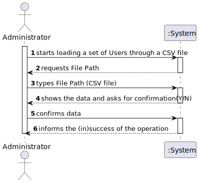

# US 003 - Administrator

## 1. Requirements Engineering

### 1.1. User Story Description

*As an administrator, I want to load a set of users from a CSV file.*

### 1.2. Customer Specifications and Clarifications 

**From the Specifications Document:**

> No data was found relating to loading a set of users from a CSV file. However, from past User Scenarios, it was specified the User's criteria for being registered, so it may be the same for loading.

**From the client clarifications:**

> **Question: Regarding US014, I would like to clarify if the CSV file only contains information about SNS users of if the CSV file may also contain some information about employees from that vaccination center.**
> 
> **Answer: The CSV file only contains information about SNS users.**

> **Question: What would be the sequence of parameters to be read on the CSV? For example: "Name | User Number.** 
>
> **Answer: The attributes that should be used to describe a SNS user are: Name, Address, Sex, Phone Number, E-mail, Birth Date, SNS User Number and Citizen Card Number.**

### 1.3. Acceptance Criteria

 - *AC1:The application must support importing two types of CSV  files: one type must have a header, column separation is done using “;” character, the other type does not have a header, column separation is done using “,” character.*

### 1.4. Found out Dependencies

*US3, since we will use its controller in order to load the Users into the System.*

### 1.5 Input and Output Data

**Input Data:**
* Typed Data:
    * File Name
* Selected Data: SNS User's data from given CSV file.(Specified in the US003).

**Output Data:**
* (In)Success of the operation.

### 1.6. System Sequence Diagram (SSD)

### 1.7 Other Relevant Remarks

n/a

## 2. OO Analysis

### 2.1. Relevant Domain Model Excerpt 

### 2.2. Other Remarks

n/a

## 3. Design - User Story Realization 

### 3.1. Rationale

**The rationale grounds on the SSD interactions and the identified input/output data.**

| Interaction ID | Question: Which class is responsible for...   | Answer | Justification (with patterns) |
|:---------------|:----------------------------------------------|:-------|:------------------------------|
| Step 1  		     | 							                                       |        |                               |
| Step 2  		     | 				                                          |        |                               |
| Step 3  		     | 							                                       |        |                               |
| Step 4  		     | 							                                       |        |                               |
| Step 5  		     | 							                                       |        |                               |
| Step 6  		     | 							                                       |        |                               |              
| Step 7  		     | 							                                       |        |                               |
| Step 8  		     | 							                                       |        |                               |

### Systematization ##

According to the taken rationale, the conceptual classes promoted to software classes are: 

 * Company
 * SNSUser

Other software classes (i.e. Pure Fabrication) identified: 
 * LoadUsersUI (Pure Fabrication) 
 * SpecifyNewSNSUserController (Controller)
 * SNSUserStore

## 3.2. Sequence Diagram (SD)

*In this section, it is suggested to present an UML dynamic view stating the sequence of domain related software objects' interactions that allows to fulfill the requirement.* 

## 3.3. Class Diagram (CD)

*In this section, it is suggested to present an UML static view representing the main domain related software classes that are involved in fulfilling the requirement as well as and their relations, attributes and methods.*

# 4. Tests 
*In this section, it is suggested to systematize how the tests were designed to allow a correct measurement of requirements fulfilling.* 

**_DO NOT COPY ALL DEVELOPED TESTS HERE_**

**Test 1:** Check that it is not possible to create an instance of the Example class with null values. 

	@Test(expected = IllegalArgumentException.class)
		public void ensureNullIsNotAllowed() {
		Exemplo instance = new Exemplo(null, null);
	}

*It is also recommended to organize this content by subsections.* 

# 5. Construction (Implementation)

*In this section, it is suggested to provide, if necessary, some evidence that the construction/implementation is in accordance with the previously carried out design. Furthermore, it is recommeded to mention/describe the existence of other relevant (e.g. configuration) files and highlight relevant commits.*

*It is also recommended to organize this content by subsections.* 

# 6. Integration and Demo 

*In this section, it is suggested to describe the efforts made to integrate this functionality with the other features of the system.*

# 7. Observations

*In this section, it is suggested to present a critical perspective on the developed work, pointing, for example, to other alternatives and or future related work.*

