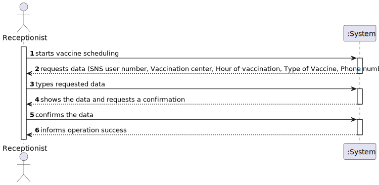
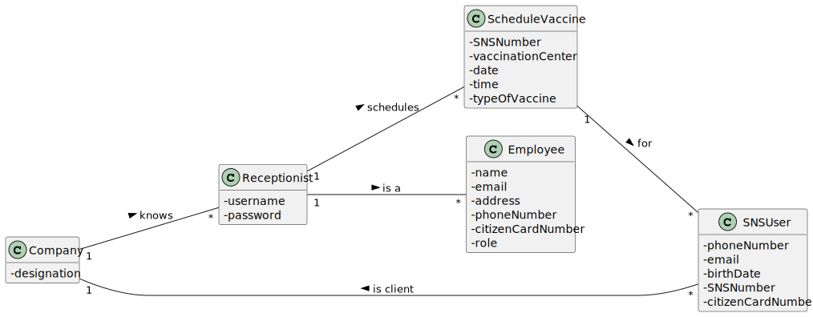
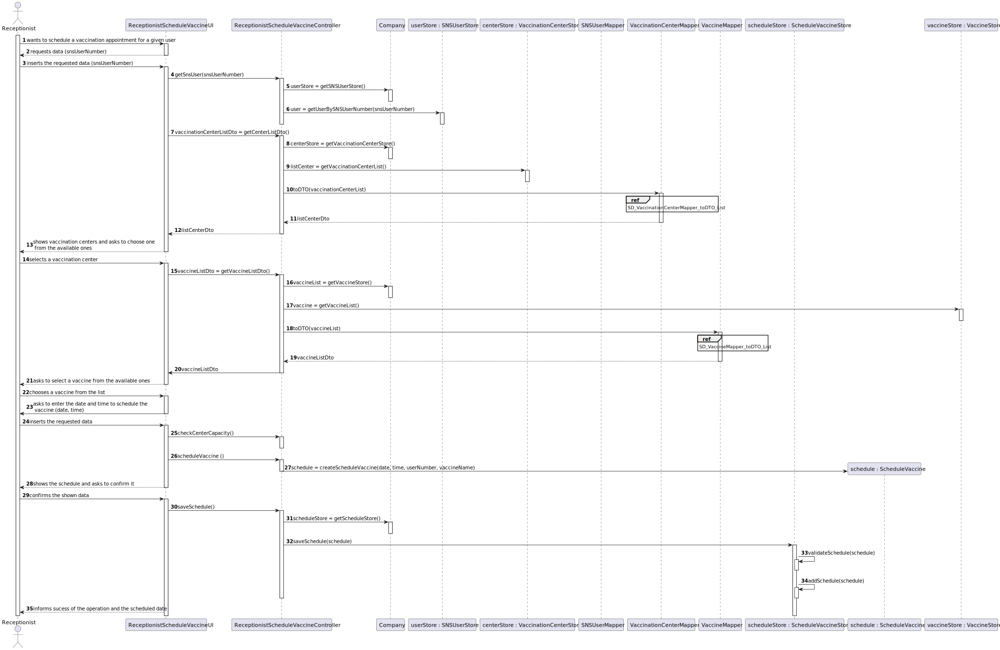
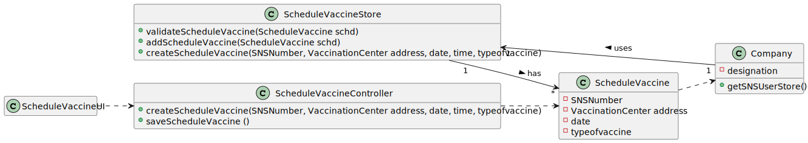

# US 002 - Scheduling a vaccination as a receptionist

## 1. Requirements Engineering

### 1.1. User Story Description

*As a receptionist at one vaccination center, I want to schedule a vaccination.*

### 1.2. Customer Specifications and Clarifications 
*From client clarifications*
> **Question:** Question: "When a receptionist schedules a vaccination for an SNS user, should they be presented with a list of available vaccines (brands, that meet acceptance criteria) from which to choose? Or should the application suggest only one?"
>
> **Answer:** The receptionist do not select the vaccine brand.
When the user is at the vaccination center to take the vaccine, the nurse selects the vaccine. In Sprint D we will introduce new USs where the nurse records the administration of a vaccine to a SNS user.
### 1.3. Acceptance Criteria

*No acceptance criteria have been given*

### 1.4. Found out Dependencies

*US 3, US 9 and US 12*

### 1.5 Input and Output Data
**Input Data:**
* Typed Data:
    * SNS User number
    * Vaccination center
    * Type of vaccine
    * Hour of vaccination
    * Phone number

* Selected Data: Phone number, E-mail and Password (all already associated to a registered user)

**Output Data:**
* (In)Success of the operation
* Confirmation of vaccine scheduling

### 1.6. System Sequence Diagram (SSD)

*Insert here a SSD depicting the envisioned Actor-System interactions and throughout which data is inputted and outputted to fulfill the requirement. All interactions must be numbered.*

### 1.7 Other Relevant Remarks

*Use this section to capture other relevant information that is related with this US such as (i) special requirements ; (ii) data and/or technology variations; (iii) how often this US is held.* 

## 2. OO Analysis

### 2.1. Relevant Domain Model Excerpt

### 2.2. Other Remarks

## 3. Design - User Story Realization 

### 3.1. Rationale

**The rationale grounds on the SSD interactions and the identified input/output data.**

| Interaction ID | Question: Which class is responsible for...                                    | Answer               | Justification (with patterns)                                                    |
|:-------------  |:-------------------------------------------------------------------------------|:---------------------|:---------------------------------------------------------------------------------|
| Step 3  		 | 	requesting the data for scheduling?						                                     | ScheduleVaccineUI    | Pure Fabrication                                                                 |
| Step 4  		 | 	Validating the scheduling of a vaccine?							                                | ScheduleVaccine      | Information Expert (knows its requirements)                                      |
| Step 5  		 | 	Validating the data globally?(duplicates)						                               | ScheduleVaccineStore | Information Expert(knows all the ScheduleVaccine Objects).                       |
| Step 6  		 | 	Saving the scheduling of a vaccine?						                                     | ScheduleVaccineStore | Information Expert(in charge of managing/recording all ScheduleVaccine Objects). |              
| Step 7  		 | 	Informing operation sucess?						                                             | ScheduleVaccineUI    | Information Expert(responsible for user interaction)                             |

### Systematization ##

According to the taken rationale, the conceptual classes promoted to software classes are: 

 * Company
 * ScheduleVaccine

Other software classes (i.e. Pure Fabrication) identified: 
 * ScheduleVaccineUI  (Pure Fabrication)
 * ScheduleVaccineController (Controller)
 * ScheduleVaccineStore (Information Expert)

## 3.2. Sequence Diagram (SD)

*In this section, it is suggested to present an UML dynamic view stating the sequence of domain related software objects' interactions that allows to fulfill the requirement.* 

## 3.3. Class Diagram (CD)

*In this section, it is suggested to present an UML static view representing the main domain related software classes that are involved in fulfilling the requirement as well as and their relations, attributes and methods.*

# 4. Tests 
*In this section, it is suggested to systematize how the tests were designed to allow a correct measurement of requirements fulfilling.* 

**_DO NOT COPY ALL DEVELOPED TESTS HERE_**

**Test 1:** Check that it is not possible to create an instance of the Example class with null values. 

	@Test(expected = IllegalArgumentException.class)
		public void ensureNullIsNotAllowed() {
		Exemplo instance = new Exemplo(null, null);
	}

*It is also recommended to organize this content by subsections.* 

# 5. Construction (Implementation)

*In this section, it is suggested to provide, if necessary, some evidence that the construction/implementation is in accordance with the previously carried out design. Furthermore, it is recommeded to mention/describe the existence of other relevant (e.g. configuration) files and highlight relevant commits.*

*It is also recommended to organize this content by subsections.* 

# 6. Integration and Demo 

*In this section, it is suggested to describe the efforts made to integrate this functionality with the other features of the system.*

# 7. Observations

*In this section, it is suggested to present a critical perspective on the developed work, pointing, for example, to other alternatives and or future related work.*

