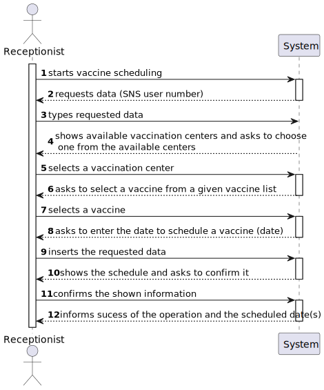
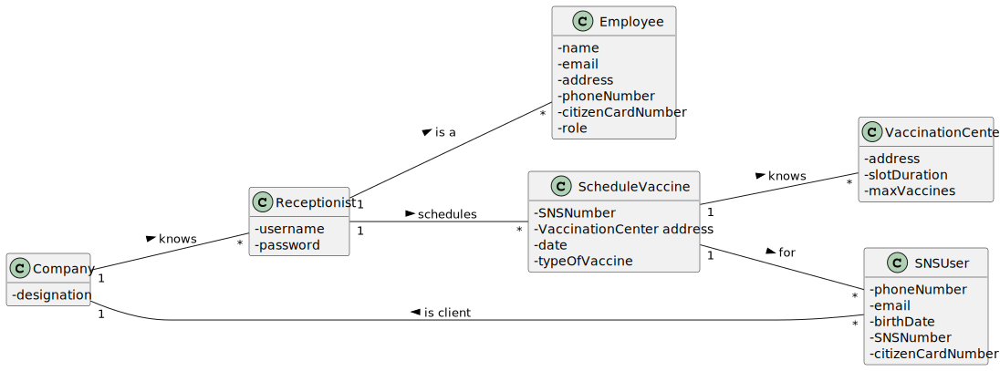
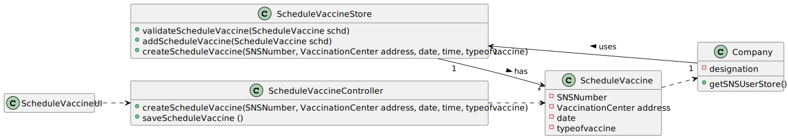

# US 002 - Scheduling a vaccination as a receptionist

## 1. Requirements Engineering

### 1.1. User Story Description

*As a receptionist at one vaccination center, I want to schedule a vaccination.*

### 1.2. Customer Specifications and Clarifications 
**From the specifications document:**

> (...) To take a vaccine, the SNS user should use the application to schedule his/her vaccination. The user
> should introduce his/her SNS user number, select the vaccination center, the date (...)

> (...) Then, the application should check the
> vaccination center capacity for that day/time and, if possible, confirm that the vaccination is
> scheduled and inform the user that (s)he should be at the selected vaccination center at the
> scheduled day and time. (...)

> (...) Some users (e.g.: older ones) may want to go to a healthcare center to schedule the
> vaccine appointment with the help of a receptionists at one vaccination center.

**From the client clarifications:**

> **Question :** "Regarding US02, i would like to know if a receptionist has the ability to schedule an appointment in
> different vaccination centres or only on their own."
>
> **Answer :** The receptionist has the ability to schedule the vaccine in any vaccination center. The receptionist
> should ask the SNS user to indicate/select the preferred vaccination center.

> **Question  :** "I would like to ask if you could tell me if my interpretation of this US was correct.So my
> interpretation was that the receptionist should choose a vaccination center and than in that vaccination center she
> would schedule the second dosage of the vaccine"
>
>  **Answer :** The goal of this US is to schedule a vaccination for a SNS user. The SNS user should go to a vaccination
> center and a receptionist should use the application to schedule a vaccination for the SNS user. The receptionist should
> ask the SNS user for data required to schedule a vaccination. The data needed to schedule a vaccination is the same
> required in US01. Please check the Project Description available in moodle.

*No acceptance criteria have been given*

### 1.4. Found out Dependencies

*US 3, US 9, US 12 and US1*

### 1.5 Input and Output Data
**Input Data:**
* Typed Data:
    * SNS User number
    * Vaccination center address
    * Type of vaccine
    * Date and time of vaccination

**Output Data:**
* (In)Success of the operation
* Confirmation of vaccine scheduling

### 1.6. System Sequence Diagram (SSD)

*Insert here a SSD depicting the envisioned Actor-System interactions and throughout which data is inputted and outputted to fulfill the requirement. All interactions must be numbered.*

### 1.7 Other Relevant Remarks

*Use this section to capture other relevant information that is related with this US such as (i) special requirements ; (ii) data and/or technology variations; (iii) how often this US is held.* 

## 2. OO Analysis

### 2.1. Relevant Domain Model Excerpt

### 2.2. Other Remarks

## 3. Design - User Story Realization 

### 3.1. Rationale

**The rationale grounds on the SSD interactions and the identified input/output data.**

| Interaction ID | Question: Which class is responsible for...                      | Answer                        | Justification (with patterns)                                                    |
|:---------------|:-----------------------------------------------------------------|:------------------------------|:---------------------------------------------------------------------------------|
| Step 3  		     | 	requesting the SNS number?						                                | ReceptionistScheduleVaccineUI | Pure Fabrication                                                                 |
| Step 4  		     | 	validating the sns number (if it registeresd)?							           | SNSUserStore                  | Information Expert (knows all the SNSUser objects)                               |
| Step 5  		     | 	showing the vaccination centers and asking to select one?						 | ScheduleVaccineUI             | Information Expert(responsible for user interaction)                       |
| Step 6  		     | 	showing the vaccine and asking to select one?						             | ScheduleVaccineUI             | Information Expert(responsible for user interaction) |              
| Step 7  		     | 	requesting the date to schedule?						                          | ReceptionistScheduleVaccineUI | Information Expert(responsible for user interaction)                             |
| Step 8  		     | 	Validating the date (if any vaccine is already scheduled)						 | ScheduleVaccineStore          | Information Expert(knows all the ScheduleVaccine Objects).                       |
| Step 9  		     | 	Saving the scheduling of a vaccine?						                       | ScheduleVaccineStore          | Information Expert(in charge of managing/recording all ScheduleVaccine Objects). |              
| Step 7  		     | 	Informing operation sucess?						                               | ReceptionistScheduleVaccineUI | Information Expert(responsible for user interaction)                             |

### Systematization ##

According to the taken rationale, the conceptual classes promoted to software classes are: 

 * Company
 * ScheduleVaccine

Other software classes (i.e. Pure Fabrication) identified: 
 * ReceptionistScheduleVaccineUI  (Pure Fabrication)
 * ReceptionistScheduleVaccineController (Controller)
 * ScheduleVaccineStore (Information Expert)

## 3.2. Sequence Diagram (SD)

*In this section, it is suggested to present an UML dynamic view stating the sequence of domain related software objects' interactions that allows to fulfill the requirement.* 

## 3.3. Class Diagram (CD)

*In this section, it is suggested to present an UML static view representing the main domain related software classes that are involved in fulfilling the requirement as well as and their relations, attributes and methods.*

# 4. Tests 
*In this section, it is suggested to systematize how the tests were designed to allow a correct measurement of requirements fulfilling.* 

**_DO NOT COPY ALL DEVELOPED TESTS HERE_**

**Test 1:** Check that it is not possible to create an instance of the Example class with null values. 

	@Test(expected = IllegalArgumentException.class)
		public void ensureNullIsNotAllowed() {
		Exemplo instance = new Exemplo(null, null);
	}

*It is also recommended to organize this content by subsections.* 

# 5. Construction (Implementation)

*In this section, it is suggested to provide, if necessary, some evidence that the construction/implementation is in accordance with the previously carried out design. Furthermore, it is recommeded to mention/describe the existence of other relevant (e.g. configuration) files and highlight relevant commits.*

*It is also recommended to organize this content by subsections.* 

# 6. Integration and Demo 

*In this section, it is suggested to describe the efforts made to integrate this functionality with the other features of the system.*

# 7. Observations

*In this section, it is suggested to present a critical perspective on the developed work, pointing, for example, to other alternatives and or future related work.*

