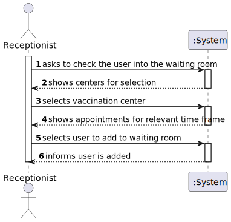
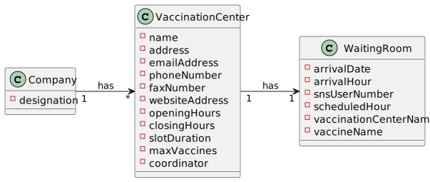

# US 004 - Receptionist

## 1. Requirements Engineering

### 1.1. User Story Description

*As a receptionist, I intend to check the SNS users into the waiting room of a vaccination center.*

### 1.2. Customer Specifications and Clarifications

**From the Specifications Document:**

**From the client clarifications:**

> **Question: "Regarding US04, the attribute "arrival time" should be considered to let the user enter the waiting room.
    For example, a user that arrives 40 minutes after his appointment wont be allowed to enter the center, and another who only arrives 10 minutes late may proceed. If so, how much compensation time should we provide to the user."**
> 
> **Answer: In this sprint we are not going to address the problem of delays. All arriving users are attended and registered by the receptionist.**

> **Question: "The nurse must have the possibility to choose which center she wants to register the SNS user's arrival every time she uses this feature, or should we make the nurse pick a center after they log in?"**
> 
> **Answer: To start using the application, the nurse should first select the vaccination center where she is working.**

> **Question: "When the receptionist registers a SNSUser arrival, should we validate that the vaccination center where the SNS user arrives is the same as where the receptionist is currently working? If so, should we allocate receptionists to vaccination centers, i.e., ask the receptionist which vaccination center is she currently working at?"**
> 
> **Answer: To start using the application, the receptionist should first select the vaccination center where she is working. The receptionists register the arrival of a SNS user at the vaccination center where she is working.**

> **Question: "Regarding US04, a receptionist register the arrival of a SNS user immediately when he arrives at the vaccination center or only after the receptionist confirms that the respective user has a vaccine schedule for that day and time."**
> 
> **Answer: The receptionist registers the arrival of a SNS user only after confirming that the user has a vaccine scheduled for that day and time.**

> **Question: "When the SNS user number is introduce by the receptionist and the system has no appointment for that SNS user number, how should the system proceed?"**
> 
> **Answer: The application should present a message saying that the SNS user did not scheduled a vaccination.**

> **Question: "Regarding US04, i would like to know what's the capacity of the waiting room."**
> 
> **Answer: The waiting room will not be registered or defined in the system. The waiting room of each vaccination center has the capacity to receive all users who take the vaccine on given slot.**

> **Question: "Respectively to US04, after the receptionist registers the SNS User's arrival at the Vaccination Center, the system creates the list that will be available for the Nurse to view, correct?"**
> 
> **Answer: The nurse checks the list (of SNS users in the waiting room) in US05.**

### 1.3. Acceptance Criteria

- *No duplicate entries should be possible for the same SNS user on the same day or vaccine period.*

### 1.4. Found out Dependencies

*US1 or US2, since the user needs to have a vaccine scheduled.*

### 1.5 Input and Output Data

**Input data:**
* Selected:
  * Center
  * Scheduled User.

**Output data:**

### 1.6. System Sequence Diagram (SSD)

### 1.7 Other Relevant Remarks

*n/a*

## 2. OO Analysis

### 2.1. Relevant Domain Model Excerpt

### 2.2. Other Remarks

*n/a*

## 3. Design - User Story Realization

### 3.1. Rationale

**The rationale grounds on the SSD interactions and the identified input/output data.**

| Interaction ID | Question: Which class is responsible for...                    | Answer                 | Justification (with patterns) |
|:-------------  |:---------------------------------------------------------------|:-----------------------|:------------------------------|
| Step 1  		 | ...asking the User to select a vaccination center?		           | RegisterArrivalUI      | Pure Fabrication              |
| Step 2  		 | 	...knowing the vaccination centers?		                         | VaccinationCenterStore | Information Expert            |
| Step 3  		 | ...asking the user to select a scheduled vaccination?          | RegisterArrivalUI      | Pure Fabrication              |
| Step 4  		 | ...knowing the scheduled vaccines?                             | scheduledVaccineStore  | Information Expert            |
| Step 5  		 | ...saving user to waiting room?                                | WaitingRoomStore       | Information Expert            |
| Step 6  		 | ...informing user was successfully added to waiting room?					 | RegisterArrivalUI      | Information Expert            |

### Systematization ##

According to the taken rationale, the conceptual classes promoted to software classes are:

* WaitingRoom

Other software classes (i.e. Pure Fabrication) identified:
* RegisterArrivalUI
* RegisterArrivalController

## 3.2. Sequence Diagram (SD)

## 3.3. Class Diagram (CD)

# 4. Tests
*In this section, it is suggested to systematize how the tests were designed to allow a correct measurement of requirements fulfilling.*

**_DO NOT COPY ALL DEVELOPED TESTS HERE_**

**Test 1:** Check that it is not possible to create an instance of the Example class with null values.

	@Test(expected = IllegalArgumentException.class)
		public void ensureNullIsNotAllowed() {
		Exemplo instance = new Exemplo(null, null);
	}

*It is also recommended to organize this content by subsections.*

# 5. Construction (Implementation)

*In this section, it is suggested to provide, if necessary, some evidence that the construction/implementation is in accordance with the previously carried out design. Furthermore, it is recommeded to mention/describe the existence of other relevant (e.g. configuration) files and highlight relevant commits.*

*It is also recommended to organize this content by subsections.*

# 6. Integration and Demo

*In this section, it is suggested to describe the efforts made to integrate this functionality with the other features of the system.*

# 7. Observations

*In this section, it is suggested to present a critical perspective on the developed work, pointing, for example, to other alternatives and or future related work.*

