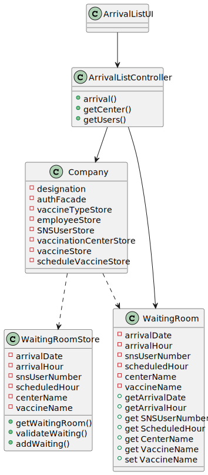

# US 005 - Nurse

## 1. Requirements Engineering

### 1.1. User Story Description

*As a nurse, I intend to consult the users in the waiting room of a vaccination center.*

### 1.2. Customer Specifications and Clarifications 

**From the Specifications Document:**

>**"As the allocation of receptionists and nurses to vaccination centers might be complex, by now, the system might assume that receptionists and nurses can work on any vaccination center."**

>**"At any time, a nurse responsible for administering the vaccine will use the application to check the list of SNS users that are present in the vaccination center to take the vaccine and will call one SNS user to administer him/her the vaccine."**

**From the client clarifications:**

> **Question: "Regarding the US05. In the PI description it is said that, by now, the nurses and the receptionists will work at any center. Will this information remain the same on this Sprint, or will they work at a specific center?"**
>
> **Answer: Nurses and receptionists can work in any vaccination center.**

>**Question: "Regarding US05, what does consulting constitute in this context? Does it refer only to seeing who is present and deciding who gets the vaccine or is checking the user info to administer the vaccine, registering the process, and sending it to the recovery room also part of this US?"**
> 
> **Answer: The goal is to check the list of users that are waiting and ready to take the vaccine.**

>**Question: "Do we need to know if the nurse has to choose the vaccination center before executing the list or if that information comes from employee file?"**
> 
> **Answer: When the nurse starts to use the application, firstly, the nurse should select the vaccination center where it's working. The nurse wants to check the list of SNS users that are waiting in the vaccination center where it is working.**

>**Question: "Do we need to know what is the name of the attribute that defines that the user has arrived. In the last sprint we have created the “Status” attribute, can we continue using it?"**
> 
> **Answer: This is not a question for the client.**

>**Question: "I would like to know which are the attributes of the waiting room."**
> 
> **Answer: The waiting room will not be registered or defined in the system. The waiting room of each vaccination center has the capacity to receive all users who take the vaccine on given slot.**

>**Question: "Regarding US05, is the listing supposed to be for the day itself or for a specific day?"**
> 
> **Answer: The list should show the users in the waiting room of a vaccination center.**

>**Question: "What information about the Users (name, SNS number, etc) should the system display when listing them?"**
> 
> **Answer: Name, Sex, Birth Date, SNS User Number and Phone Number.**

>**Question: "Is it supposed to remove the SNS user of the wait list when he leaves the waiting room to get the vaccine? If yes, how do we know when the sns user leaves the waiting room?"**
> 
> **Answer: US5 is only to list users that are in the waiting room of a vaccination center. In Sprint D we will introduce new user stories.**

### 1.3. Acceptance Criteria

- *AC1: SNS Users’ list should be presented by order of arrival.*

### 1.4. Found out Dependencies

*US9, since we need a list of vaccination centers where the nurse can work in order for her to choose.*
*US4, since we need to have a list of users in the waiting room in order to consult it.*

### 1.5 Input and Output Data

**Input data:**
* Vaccination Center in which the nurse is working.

**Output data:**
* List of users in the waiting room of chosen vaccination center.

### 1.6. System Sequence Diagram (SSD)

### 1.7 Other Relevant Remarks

*n/a*

## 2. OO Analysis

### 2.1. Relevant Domain Model Excerpt 

### 2.2. Other Remarks

*Use this section to capture some additional notes/remarks that must be taken into consideration into the design activity. In some case, it might be useful to add other analysis artifacts (e.g. activity or state diagrams).* 

## 3. Design - User Story Realization 

### 3.1. Rationale

**The rationale grounds on the SSD interactions and the identified input/output data.**

| Interaction ID | Question: Which class is responsible for...                    | Answer                 | Justification (with patterns) |
|:-------------  |:---------------------------------------------------------------|:-----------------------|:------------------------------|
| Step 1  		 | 	... interacting with the nurse?						                         | ArrivalListUI          | Pure Fabrication              |
| | ... directing the flow of data between all classes?            | ArrivalListController  | Controller                    |
| Step 2  		 | 	... knowing all vaccination centers?						                    | VaccinationCenterStore | High Cohesion Low Coupling    |
| Step 3  		 | 	... having a list of people in the waiting room?					         | WaitingRoom            | Information Expert            |
| Step 4  		 | 	... informing the user of success/failure of operation?						 | ArrivalListUI          | Information Expert            |

### Systematization ##

According to the taken rationale, the conceptual classes promoted to software classes are: 

 * Company
 * WaitingRoomStore

Other software classes (i.e. Pure Fabrication) identified: 
 * ArrivalListUI  
 * ArrivalListController

## 3.2. Sequence Diagram (SD)

## 3.3. Class Diagram (CD)

# 4. Tests 

*n/a*

# 5. Construction (Implementation)

*In this section, it is suggested to provide, if necessary, some evidence that the construction/implementation is in accordance with the previously carried out design. Furthermore, it is recommended to mention/describe the existence of other relevant (e.g. configuration) files and highlight relevant commits.*

*It is also recommended to organize this content by subsections.* 

# 6. Integration and Demo 

# 7. Observations

*None.*

