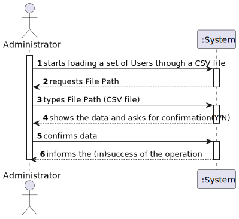
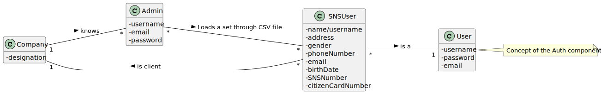
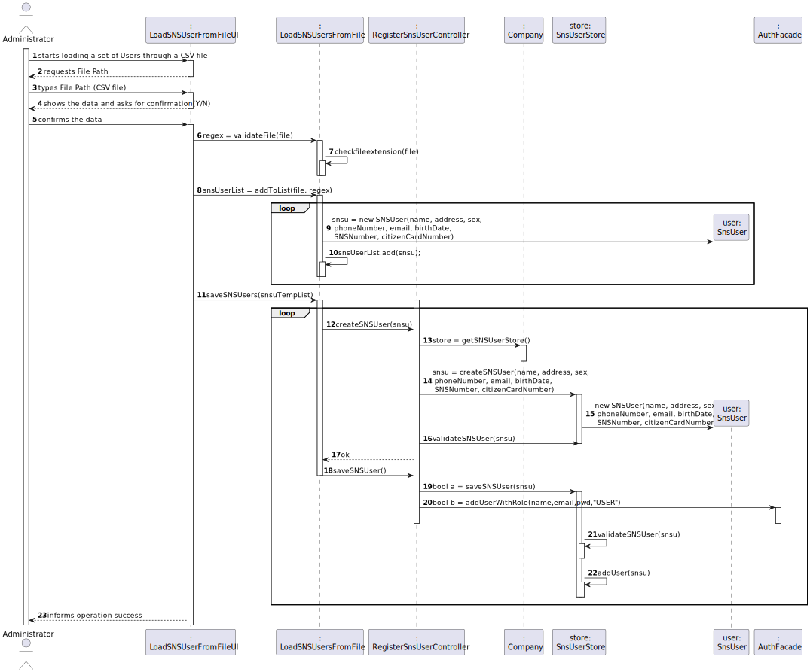
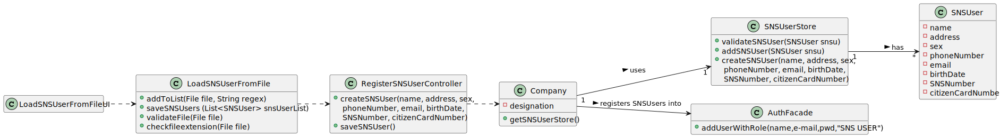

# US 014 - Administrator

## 1. Requirements Engineering

### 1.1. User Story Description

*As an administrator, I want to load a set of users from a CSV file.*

### 1.2. Customer Specifications and Clarifications 

**From the Specifications Document:**

> No data was found relating to loading a set of users from a CSV file. However, from past User Scenarios, it was specified the User's criteria for being registered, so it may be the same for loading.

**From the client clarifications:**

> **Question: Regarding US014, I would like to clarify if the CSV file only contains information about SNS users of if the CSV file may also contain some information about employees from that vaccination center.**
> 
> **Answer: The CSV file only contains information about SNS users.**

> **Question: What would be the sequence of parameters to be read on the CSV? For example: "Name | User Number.** 
>
> **Answer: The attributes that should be used to describe a SNS user are: Name, Address, Sex, Phone Number, E-mail, Birth Date, SNS User Number and Citizen Card Number.**

> **Question: Is it possible that the file can contain lines with incomplete information in some fields (e.g. N/A). If so, should we read those lines as well and leave those fields empty or shall we discard that complete line?**
> 
> **Answer: CSV files that have errors should not be loaded. Opcional attributes may have a NA value.**

> **Question: Should our application detect if the CSV file to be loaded contains the header, or should we ask the user if is submitting a file with a header or not?**
> 
> **Answer: The application should automatically detect the CSV file type.**

> **Question: Should we check if the users from the CSV file are already registered in the system? If so, which data should we use, the one already in the system or the one on the file?**
> 
> **Answer: This feature of the system will be used to register a batch users. If the user is already registered in the system, then the information available in the CSV file should not be used to register that user.**

### 1.3. Acceptance Criteria

 - *AC1:The application must support importing two types of CSV  files: one type must have a header, column separation is done using “;” character, the other type does not have a header, column separation is done using “,” character.*

### 1.4. Found out Dependencies

*US3, since we will use its store and its domain concept in order to load the Users into the System.*

### 1.5 Input and Output Data

**Input Data:**
* Typed Data:
    * File Path/Name
* Selected Data:
    * n/a

**Output Data:**
* (In)Success of the operation.

### 1.6. System Sequence Diagram (SSD)

### 1.7 Other Relevant Remarks

n/a

## 2. OO Analysis

### 2.1. Relevant Domain Model Excerpt 

### 2.2. Other Remarks

n/a

## 3. Design - User Story Realization 

### 3.1. Rationale

**The rationale grounds on the SSD interactions and the identified input/output data.**

| Interaction ID | Question: Which class is responsible for...                   | Answer              | Justification (with patterns)                                            |
|:---------------|:--------------------------------------------------------------|:--------------------|:-------------------------------------------------------------------------|
| Step 1  		     | Asking the System User the path?							                       | LoadSNSUsersUI      | Pure Fabrication.                                                        |
| Step 2  		     | Verifying the File extension and format?				                  | LoadSNSUserFromFile | Pure Fabrication.                                                        |
| Step 3  		     | Instantiating a new SNSUser?				                              | SNSUserStore        | Creator.                                                                 |
| Step 4  		     | Validating the instantiation of each SNSUser?(locally)							 | SNSUser             | Information Expert(knows its requirements).                              |
| Step 5  		     | Validating the data globally?(duplicates)							              | SNSUserStore        | Information Expert(knows all the SNSUser Objects).                       |
| Step 6  		     | Saving the SNSUser?							                                    | SNSUserStore        | Information Expert(in charge of managing/recording all SNSUser Objects). |
| Step 7  		     | Informing opperation success?							                          | LoadSNSUsersUI      | Information Expert(responsible for user interaction).                    |

### Systematization ##

According to the taken rationale, the conceptual classes promoted to software classes are: 

 * Company
 * SNSUser

Other software classes identified:

 * LoadSNSUsersUI (Pure Fabrication) 
 * RegisterSNSUserController (Controller)
 * LoadSNSUserFromFile (Pure Fabrication)
 * SNSUserStore (High Cohesion/Low Coupling)

## 3.2. Sequence Diagram (SD)

*In this section, it is suggested to present an UML dynamic view stating the sequence of domain related software objects' interactions that allows to fulfill the requirement.* 

## 3.3. Class Diagram (CD)

# 4. Tests 

**Test 1:** Verifies that it cannot be created a SNS User with an empty/short name. 

	@Test
    void testInvalidName() {
        //Invalid name testing
        Throwable thrown = assertThrows(IllegalArgumentException.class, () -> {
            SNSUser user = new SNSUser("", "Rua x", "1", "912345678", "example@gmail.com", "1-1-2000", "123456789", "10102020");
        });
        assertEquals("Name is too short", thrown.getMessage());
    }

**Test 2:** Verifies that it cannot be created a SNS User with an email with a wrong pattern.

    @Test
    void testInvalidEmail() {
        //Invalid email testing
        Throwable thrown4 = assertThrows(IllegalArgumentException.class, () -> {
            SNSUser user = new SNSUser("Example", "Rua x", "1", "912345678", "examplegmailcom", "1-1-2000", "123456789", "10102020");
        });
        assertEquals("Email Is Not Valid!", thrown4.getMessage());
    }

**Test 3:** Verifies that it cannot be created a SNS User with an invalid citizen card number.

    @Test
    void testInvalidCitizenCardNumber() {
        //Invalid Citizen Card Number testing
        Throwable thrown6 = assertThrows(IllegalArgumentException.class, () -> {
            SNSUser user = new SNSUser("Example", "Rua x", "1", "912345678", "example@gmail.com", date, "123456789", "1010202");
        });
        assertEquals("Invalid Citizen Card Number", thrown6.getMessage());
    }

**Test 4:** Verifies that it cannot be created a SNS User with an invalid phone number.

    @Test
    void testInvalidPhoneNumber() {
        //Invalid phone number testing
        Throwable thrown3 = assertThrows(IllegalArgumentException.class, () -> {
            SNSUser user = new SNSUser("Example", "Rua x", "1", "9123456789", "example@gmail.com", date, "123456789", "10102020");
        });
        assertEquals("Invalid Phone Number", thrown3.getMessage());
    }

# 5. Construction (Implementation)

*In this section, it is suggested to provide, if necessary, some evidence that the construction/implementation is in accordance with the previously carried out design. Furthermore, it is recommeded to mention/describe the existence of other relevant (e.g. configuration) files and highlight relevant commits.*

*It is also recommended to organize this content by subsections.* 

# 6. Integration and Demo 

# 7. Observations

*Since we had bad coding placement, we had to change some functions places which was hard and confusing at first, but then made sense and helped achive High Cohesion and Low Coupling.*

