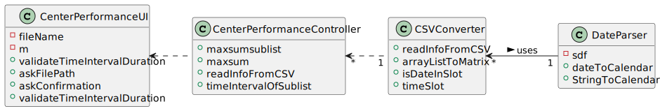

# US 016 - Center Coordinator

## 1. Requirements Engineering

### 1.1. User Story Description

*As a center coordinator, I intend to analyze the performance of a center*

### 1.2. Customer Specifications and Clarifications

**From the Specifications Document:**
* This US should implement a procedure that, for a specific time of day, and intervals of m minutes  chosen by the coordinator, with a daily work from 8AM to 8PM the procecdure creates a list of length 720/m;
* The i-th value of the list is the difference between the number of clients arriving and the number of clients leaving at that i-th time interval.
* The application should implement a brute force algorithm to determine the contiguous sublist of maximum sum;

**From the client clarifications:**
> Question : The file loaded in US17 have only one day to analyse or it could have more than one day(?) and in US16 we need to select the day to analyse from 8:00 to 20:00?
> Answer: The file can have data from more than one day. In US16 the center coordinator should select the day for which he wants to analyse the performance of the vaccination center.

>Question: "Should the configuration file be defined , manually, before strating the program? Or Should an administrator or another DGS entity be able to alter the file in a user interface? This question is also important for US06 and US16 since these US also use configuration files, will the same process be applied to them?"
>Answer: The configuration file should be edited manually.

>Question: "Is the time of departure of an SNS user the time he got vaccinated plus the recovery time or do we have another way of knowing it?"
>Answer: The time of departure of an SNS user is the time he got vaccinated plus the recovery time.

>Question: "In US 16, should the coordinator have the option to choose which algorithm to run (e.g. via a configuration file or while running the application) in order to determine the goal sublist, or is the Benchmark Algorithm strictly for drawing comparisons with the Bruteforce one?"
>Answer: The algorithm to run should be defined in a configuration file.

>Question: "I would like to ask that if to analyse the performance of a center, we can assume (as a pre requirement) that the center coordinator was already attributed to a specific vaccination center and proceed with the US as so (like the center coordinator does not have to choose at a certain point where he is working. This is already treated before this US happens). Could you clarify this?"
>Answer: A center coordinator can only coordinate one vaccination center. The center coordinator can only analyze the performance of the center that he coordinates.

>Question: "I would like to know if we could strict the user to pick only those intervals (m) (i.e. 1, 5, 10, 20, 30) as options for analyzing the performance of a center, since picking intervals is dependent on the list which is 720/m (which the length is an integer result). If we let the user pick an interval that results in a non-integer result, this will result in an invalid list since some data for the performance analysis will be lost. Can you provide a clarification on this situation?"
>Answer: The user can introduce any interval value. The system should validate the interval value introduced by the user.

### 1.3. Acceptance Criteria

N/a

### 1.4. Found out Dependencies

### 1.5 Input and Output Data

**Input Data:**
* Typed Data:
  * File Path/Name
  * Duration of the time intervals into which the work day will be divided
* Selected Data:
  * n/a

**Output Data:**
* (In)Success of the operation.
* Input list
* Maximum sum contiguous sublist
* Sum of the maximum sum contiguous sublist
* Time interval corresponding to the  Maximum sum contiguous sublist

### 1.6. System Sequence Diagram (SSD)

### 1.7 Other Relevant Remarks

n/a

## 2. OO Analysis

### 2.1. Relevant Domain Model Excerpt

### 2.2. Other Remarks

n/a

## 3. Design - User Story Realization

### 3.1. Rationale

**The rationale grounds on the SSD interactions and the identified input/output data.**

| Interaction ID | Question: Which class is responsible for...                                                    | Answer                      | Justification (with patterns)           |
|:---------------|:-----------------------------------------------------------------------------------------------|:----------------------------|:----------------------------------------|
| Step 1  		     | Asking the file path?		                                                                        | CenterPerformanceUI        | Pure Fabication                         |
| Step 2  		     | Verifying the file extension and format?	                                                      | CSVConverter                | Pure fabrication                        |
| Step 3  		     | Asking the duration of the time interval?                                                      | CenterPerformanceUI         | Informatio expert                       |
| Step 4  		     | Verifying the duration of the time interval?                                                   | CenterPerformanceController | Controller                              |
| Step 5  		     | Reading the file? 						                                                                       | CSVConverter                | Information expert                      |
| Step 6  		     | Converting the info from the file into a suitable format?					                                 | DateParser                  | Pure Fabrication                        |
| Step 7  		     | Creating the list with the vaccination center's performance?					                              | CSVConverter                | Creator                                 |
| Step 8  		     | Calculating the maximum sum contiguous sublist?		                                              | CenterPerformanceController |                                         |
| Step 9 		      | Calculating the sum of all the elements of the maximum sum contiguous sublist?	                | CenterPerformanceController |                                         |
| Step 10  		    | Determining the time interval relative to the max sum contiguous sublist?                      | CenterPerformanceController |                                         |
| Step 11  		    | Determining the execution time of both the benchmark algortihm and of the developed algorithm? | CenterPerformanceController |                                         |
| Step 12  		    | Showing the results of the operations?                                                         | CenterPerformanceUI       |                                         |

### Systematization ##

According to the taken rationale, the conceptual classes promoted to software classes are:

* CenterPerformance

Other software classes identified:

* CSVConverter (Pure Fabrication)
* CenterPerformanceController (Controller)
* DateParser (Pure Fabrication)
* SNSUserStore (High Cohesion/Low Coupling)
* * CenterPerformanceUI (Pure Fabrication)

## 3.2. Sequence Diagram (SD)

*In this section, it is suggested to present an UML dynamic view stating the sequence of domain related software objects' interactions that allows to fulfill the requirement.*

## 3.3. Class Diagram (CD)

# 4. Tests

# 5. Construction (Implementation)

In this US neither a store class nor an object class were created since no objects were created during it's development 

# 6. Integration and Demo

# 7. Observations

*

