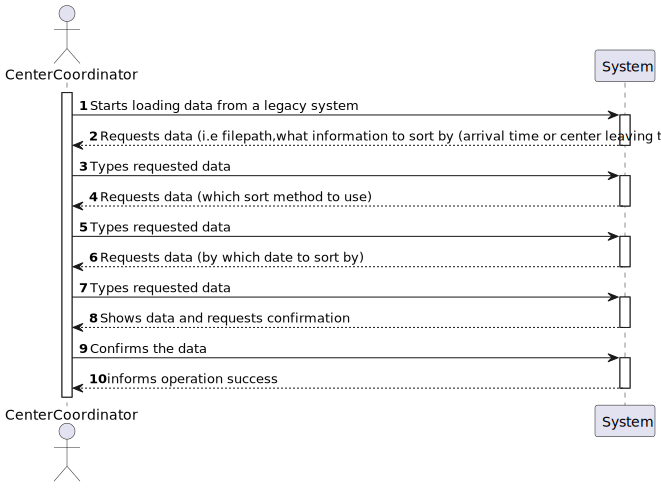
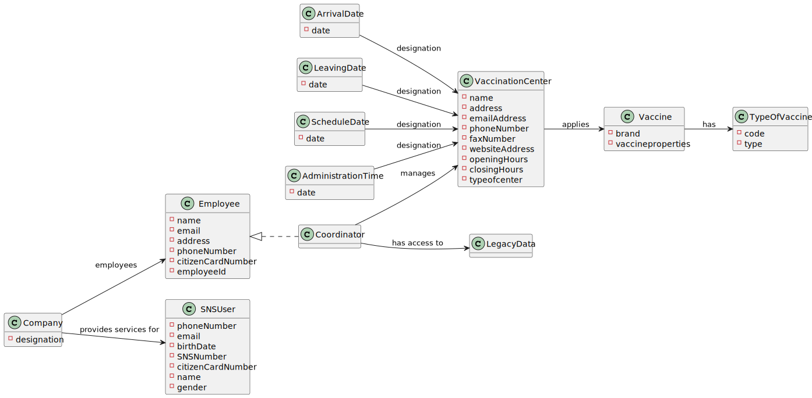
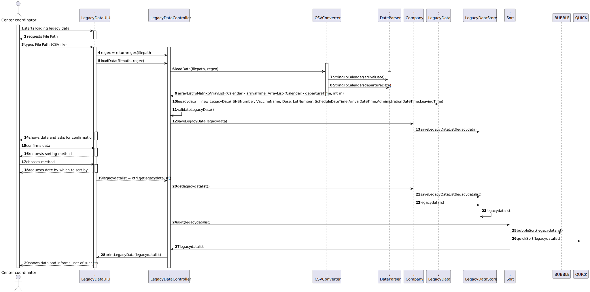
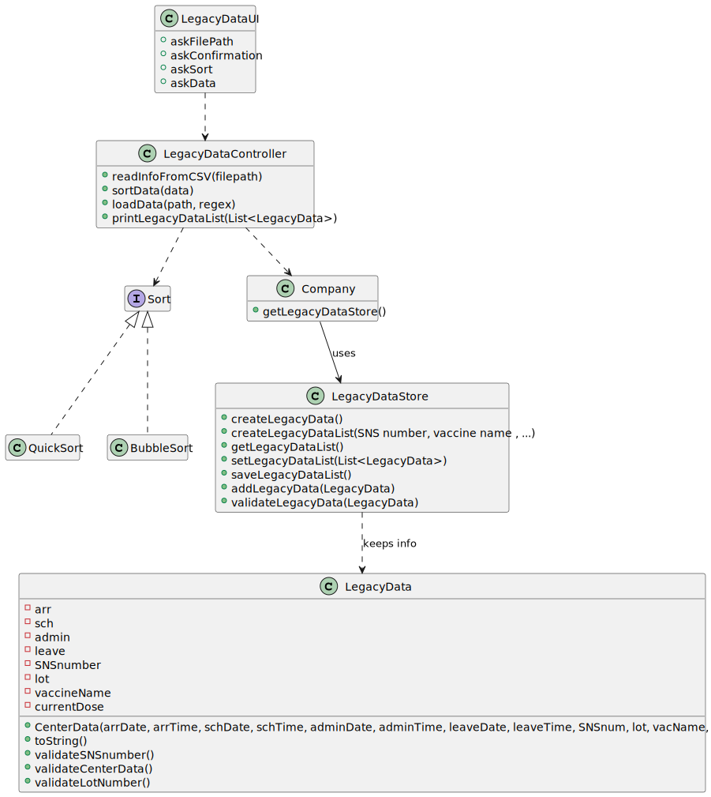

# US 016 - Center Coordinator

## 1. Requirements Engineering

### 1.1. User Story Description

*As a center coordinator, I want to import data from a legacy system that was used in the past to manage centers.*

### 1.2. Customer Specifications and Clarifications

**From the Specifications Document:**

**From the client clarifications:**
>**Question**: "Should the imported data be available only while the program is running or should it be mixed with the schedule, arrival, nurse administration and leaving times registered in the system?"
>
> **Answer**: "This US is used to load data from a legacy system. After loading, the data should be available in the application and can be used in other US."

>**Question**: "Should we show the sorted list in the GUI or in a exported file?"
> 
>**Answer**: Should show the sorted list in the GUI. In this US the application does not export data...

>**Question**: "We'd like to know if the second column in the US17 file really is the NAME of the Vaccine or if it's the short description of the VaccineType."
>
> **Answer**: It is the name of the vaccine. The header of the CSV file includes the attribute name, which is called "VaccineName". Moreover, if you search the internet you will see what is Spikevax.

### 1.3. Acceptance Criteria
*Two sorting algorithms should be implemented (to be chosen manually by the coordinator), and worst-case time complexity of each
algorithm should be documented in the application user manual (in the annexes) that must be delivered with the application.
The center coordinator must be able to choose the file that is to be uploaded.*

### 1.4. Found out Dependencies

### 1.5 Input and Output Data

**Input Data:**
* File Path/Name

* **Selected Data** : type of sorting algorithm

**Output Data:**
* (In)Success of the operation.
* Sorted data.

### 1.6. System Sequence Diagram (SSD)

### 1.7 Other Relevant Remarks

n/a

## 2. OO Analysis

### 2.1. Relevant Domain Model Excerpt

### 2.2. Other Remarks

n/a

## 3. Design - User Story Realization

### 3.1. Rationale

**The rationale grounds on the SSD interactions and the identified input/output data.**

| Interaction ID | Question: Which class is responsible for... | Answer                   | Justification (with patterns)             |
|:---------------|:--------------------------------------------|:-------------------------|:------------------------------------------|
| Step 1  		     | Asking the file path?		                     | LoadLegacyDataUI         | Pure Fabication                           |
|                | Coordinating the US?                        | LoadLegacyDataController | Controller                                |
| Step 2  		     | Verifying the file extension and format?	   | CSVConverter             | Pure fabrication                          |
| Step 3  		     | Reading the file? 						                    | CSVConverter             | Information expert                        |
| Step 4         | Asking which sort method to use  ?          | LoadLegacyDataUI         | IE : is responsible for user interactions |
| Step 5         | Asking by which date to sort by ?           | LoadLegacyDataUI         | IE : is responsible for user interactions                                          |
| Step 6 		      | Sorting the file?					                      | Sort                     | Pure Fabrication                          |
| Step 7 		      | Showing the results of the operations?      | LoadLegacyDataUI         | IE : is responsible for user interactions ||                                             |                  |                                           |

### Systematization ##

## 3.2. Sequence Diagram (SD)

*In this section, it is suggested to present an UML dynamic view stating the sequence of domain related software objects' interactions that allows to fulfill the requirement.*

## 3.3. Class Diagram (CD)

# 4. Tests

# 5. Construction (Implementation)

*In this section, it is suggested to provide, if necessary, some evidence that the construction/implementation is in accordance with the previously carried out design. Furthermore, it is recommeded to mention/describe the existence of other relevant (e.g. configuration) files and highlight relevant commits.*

*It is also recommended to organize this content by subsections.*

# 6. Integration and Demo

# 7. Observations

*