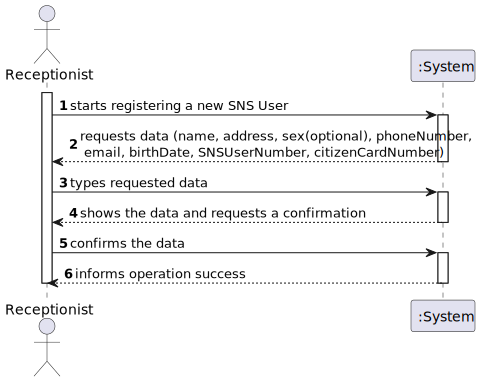

# US 003 - Receptionist

## 1. Requirements Engineering

### 1.1. User Story Description

*As a receptionist, I want to register an SNS User.*

### 1.2. Customer Specifications and Clarifications 

**From the Specifications Document:**

> Each SNS User is followed by its SNS number.

**From the client clarifications:**

> **Question: What are the necessary components in order to register an SNS User?** 
>
> **Answer: The attributes that should be used to describe a SNS user are: Name, Address, Sex, Phone Number, E-mail, Birth Date, SNS User Number and Citizen Card Number.**

### 1.3. Acceptance Criteria

 - *AC1: The SNS User must become a System User. The "auth" component available on the repository must be reused(without modifications).*
 - *AC2: The Sex attribute is optional. All other fields are required.*
 - *AC3: The E-mail, Phone Number, Citizen Card Number and SNS User Number should be unique for each SNS user.*

### 1.4. Found out Dependencies

*US10, since it is necessary for the system to have a Receptionist Menu, we need to have US10 done in order to register a Receptionist.*

### 1.5 Input and Output Data

**Input Data:**
* Typed Data:
    * Name
    * Address
    * Sex(Optional)
    * Phone Number
    * E-mail
    * Birth Date
    * SNS User Number
    * Citizen Card Number
* Selected Data: n/a

**Output Data:**
* (In)Success of the operation

### 1.6. System Sequence Diagram (SSD)

### 1.7 Other Relevant Remarks

-

## 2. OO Analysis

### 2.1. Relevant Domain Model Excerpt 

### 2.2. Other Remarks

n/a

## 3. Design - User Story Realization 

### 3.1. Rationale

**The rationale grounds on the SSD interactions and the identified input/output data.**

| Interaction ID | Question: Which class is responsible for...               | Answer                    | Justification (with patterns)                                                                                 |
|:---------------|:----------------------------------------------------------|:--------------------------|:--------------------------------------------------------------------------------------------------------------|
| Step 1  		     | 	... interacting with the actor?                          | RegisterSNSUserUI         | Pure Fabrication: there is no reason to assign this responsibility to any existing class in the Domain Model. |
| 			  		        | 	... coordinating the US?                                 | RegisterSNSUserController | Controller                                                                                                    |
| 			  		        | 	... instantiating a new SNS User?                        | SNSUserStore              | Creator (Rule 1): Store has all SNS Users.                                                                    || 			  		        | 	... knowing to which organization the user belongs to? | Platform                  | IE: has registed all Organizations                                                                            |
| Step 2  		     | 							                                                   |                           |                                                                                                               |
| Step 3  		     | 	...saving the inputted data?                             | SNSUser                   | IE: object created in step 1 has its own data.                                                                |
| Step 4  		     | 	...knowing the task categories to show?                  | SNSUserDTO                | IE: SNSUserDTO defines the categories of the SNSUser to show.                                                 |
| Step 5  		     | 	... saving the selected category?                        | SNSUser                   | IE: object created in step 1 is classified in one Category.                                                   |
| 		             | 	... validating all data (local validation)?              | SNSUser                   | IE: owns its data.                                                                                            | 
| 			  		        | 	... validating the created SNS User (global validation)? | SNSUserStore              | IE: knows all SNS Users.                                                                                      | 
| 			  		        | 	... saving the created SNS User?                         | SNSUserStore              | IE: owns all SNS Users.                                                                                       | 
| Step 6 		      | 	... informing operation success?                         | RegisterSNSUserUI         | IE: is responsible for user interactions.                                                                     | 

### Systematization ##

According to the taken rationale, the conceptual classes promoted to software classes are: 

 * Company
 * SNSUser

Other software classes (i.e. Pure Fabrication) identified: 

 * SNSUserUI(Pure Fabrication)  
 * SpecifyNewSNSUserController(Controller)
 * SNSUserStore(Information Expert)

## 3.2. Sequence Diagram (SD)

SNS User Registration SD

SNS Mapper toDTO SD

## 3.3. Class Diagram (CD)

*In this section, it is suggested to present an UML static view representing the main domain related software classes that are involved in fulfilling the requirement as well as and their relations, attributes and methods.*

# 4. Tests 
*In this section, it is suggested to systematize how the tests were designed to allow a correct measurement of requirements fulfilling.* 

    @Test
    void testInvalidName() {
    //Invalid name testing
    Throwable thrown = assertThrows(IllegalArgumentException.class, () -> {
    SNSUser user = new SNSUser("", "Rua x", "1", "912345678", "example@gmail.com", date, "123456789", "10102020");
    });
    assertEquals("Name is too short", thrown.getMessage());
    }

    @Test
    void testInvalidAddress() {
        //Invalid address testing
        Throwable thrown2 = assertThrows(IllegalArgumentException.class, () -> {
            SNSUser user = new SNSUser("Example", "", "1", "912345678", "example@gmail.com", date, "123456789", "10102020");
        });
        assertEquals("Address is too short", thrown2.getMessage());
    }

    @Test
    void testInvalidPhoneNumber() {
        //Invalid phone number testing
        Throwable thrown3 = assertThrows(IllegalArgumentException.class, () -> {
            SNSUser user = new SNSUser("Example", "Rua x", "1", "9123456789", "example@gmail.com", date, "123456789", "10102020");
        });
        assertEquals("Invalid Phone Number", thrown3.getMessage());
    }

    @Test
    void testInvalidEmail() {
        //Invalid email testing
        Throwable thrown4 = assertThrows(IllegalArgumentException.class, () -> {
            SNSUser user = new SNSUser("Example", "Rua x", "1", "912345678", "examplegmailcom", date, "123456789", "10102020");
        });
        assertEquals("Email Is Not Valid!", thrown4.getMessage());
    }

    @Test
    void testInvalidEmail2() {
        //Invalid email testing
        Throwable thrown44 = assertThrows(IllegalArgumentException.class, () -> {
            SNSUser user = new SNSUser("Example", "Rua x", "1", "912345678", "", date, "123456789", "10102020");
        });
        assertEquals("Email Can't Be Null Or Empty!", thrown44.getMessage());

    }

    @Test
    void testInvalidSNSNumber() {
        //Invalid SNS Number testing
        Throwable thrown5 = assertThrows(IllegalArgumentException.class, () -> {
            SNSUser user = new SNSUser("Example", "Rua x", "1", "912345678", "example@gmail.com", date, "12345678", "10102020");
        });
        assertEquals("Invalid SNS Number", thrown5.getMessage());
    }

    @Test
    void testInvalidCitizenCardNumber() {
        //Invalid Citizen Card Number testing
        Throwable thrown6 = assertThrows(IllegalArgumentException.class, () -> {
            SNSUser user = new SNSUser("Example", "Rua x", "1", "912345678", "example@gmail.com", date, "123456789", "1010202");
        });
        assertEquals("Invalid Citizen Card Number", thrown6.getMessage());
    }

    @Test
    void testBirthDate() {
        //Invalid Birth Date testing
        Throwable thrown = assertThrows(ParseException.class, () -> {
            SNSUser user = new SNSUser("Henrique", "Rua x", "1", "912345678", "example@gmail.com", sdf.parse("sefgsefg"), "123456789", "10102020");
        });
        assertEquals(ParseException.class, thrown.getClass());
    }

# 5. Construction (Implementation)

*In this section, it is suggested to provide, if necessary, some evidence that the construction/implementation is in accordance with the previously carried out design. Furthermore, it is recommeded to mention/describe the existence of other relevant (e.g. configuration) files and highlight relevant commits.*

*It is also recommended to organize this content by subsections.* 

# 6. Integration and Demo 

n/a

# 7. Observations

n/a

