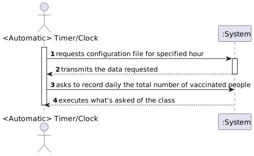

# US006 - XXXX XXXX

## 1. Requirements Engineering

### 1.1. User Story Description

*DGS wants to record daily the total number of people vaccinated in each vaccination center.*

### 1.2. Customer Specifications and Clarifications 

**From the Specifications Document:**

**From the client clarifications:**

>**Question: "According to the acceptance criteria: "the algorithm should run automatically at a time defined in a configuration file and should register a date, the name of the vaccination center and the total number of vaccinated users". How is it supposed to register this information? Should it be recorded in a file (ex: txt, csv..) or recorded in the system (ex: in a store)?"**
> 
>**Answer: The data should be written to a CSV file (field delimiter should be a semicolon).**

>**Question: "As per the acceptance criteria, can the job be deployed manually by a specific actor like Receptionist, Administrator, etc...? Who does the initial configuration for the automatic job?"**
> 
>**Answer: The algorithm should run automatically at a time defined in a configuration file and should register the date, the name of the vaccination center and the total number of vaccinated users.**

>**Question: "In this situation, the system automatically prints what is requested in order for us to don't need any user input. So, my question is: Do we need to create a UI for this US?"**
> 
>**Answer: No. Please study ESOFT!**

>**Question: "Should the Company choose first the vaccination center that wants to analyze or should the program show the information of all the vaccination centers?"**
> 
>**Answer: Please read carefully the USs requirements and discuss them with your team. The application should show the information for all vaccination centers.**

>**Question: "We would like to know which kind of user (Administrator, Nurse...) is supposed to have access to the file generated by the system."**
> 
>**Answer: Someone from DGS.**

>**Question: Also, is it supposed to have the possibility to change the information on the configuration file? If so, who can do it?"**
>
>**Answer: Yes. Please discuss this question with ESOFT teachers.**

>**Question: "After asking you to be more clear with your answer to my previous questions, you said that we can either access directly the "vaccinations report" file or create the option for center coordinators and administrators to view it's content, is this correct?"**
> 
>**Answer: You misunderstood, I didn't say that. The file should be available in the file system and anyone with access to the file system can read the file contents.**

>**Question: "I'd like to clarify something, should we implement some sort of message for when the file is saved or warning if there were any errors saving the file using JavaFX or use JavaFX in any other away in US06?"**
> 
>**Answer: No. The user story runs automatically without user interaction.**

>**Question: Also, should the time be edited directly in the configuration file or should we have a way for an administrator or some other employee to change it.**
>
>**Answer: I already answered this question. The algorithm should run automatically at a time defined in a configuration file and should register the date, the name of the vaccination center and the total number of vaccinated users. Please pay attention to the client answers and study ESOFT.**

>**Question: "Does the report contain the count of vaccinations of the current day (which depending on the time of day can be incomplete) or the day before?"**
> 
> **Answer: Should record vaccinations of the current day.**
### 1.3. Acceptance Criteria

* AC1: The algorithm should run automatically at a time defined in a configuration file and should register the date, the name of the vaccination center and the total number of vaccinated users.

### 1.4. Found out Dependencies

* US4, for the counting of people that are vaccinated throughout the day in each vaccination center. 
//just add another variable in US4, in which every time a people is accepted the counter is raised by 1.
* US9, to get the vaccination centers.
//writer class in case we make one, so the csv file is created.
* Timer class, for the program to run automatically at a time defined.

### 1.5 Input and Output Data

**Selected data:**
* Vaccination Center
* Count of vaccinated users per day in each vaccination center existing

**Output data:**
* CSV file with the date, name of the vaccination center and total number of vaccinated in each one

### 1.6. System Sequence Diagram (SSD)

### 1.7 Other Relevant Remarks

## 2. OO Analysis

### 2.1. Relevant Domain Model Excerpt 

### 2.2. Other Remarks

## 3. Design - User Story Realization 

### 3.1. Rationale

**The rationale grounds on the SSD interactions and the identified input/output data.**

| Interaction ID | Question: Which class is responsible for...                                                              | Answer  | Justification (with patterns)  |
|:-------------  |:---------------------------------------------------------------------------------------------------------|:------------|:---------------------------- |
| Step 1  		 | creating the csv file with the information required?							                                              |             |                              |
| Step 2  		 | getting the vaccination center and the total number of people vaccinated in it throughout the day?						 |             |                              |
| Step 3  		 | counting the total number of people vaccinated in each vaccination center throughout the day?							     |             |                              |
| Step 4  		 | 							                                                                                                  |             |                              |
| Step 5  		 | 							                                                                                                  |             |                              |
| Step 6  		 | 							                                                                                                  |             |                              |              
| Step 7  		 | 							                                                                                                  |             |                              |
| Step 8  		 | 							                                                                                                  |             |                              |
| Step 9  		 | 							                                                                                                  |             |                              |
| Step 10  		 | 							                                                                                                  |             |                              |  

### Systematization ##

According to the taken rationale, the conceptual classes promoted to software classes are: 

 * Class1
 * Class2
 * Class3

Other software classes (i.e. Pure Fabrication) identified: 
 * xxxxUI  
 * xxxxController

## 3.2. Sequence Diagram (SD)

## 3.3. Class Diagram (CD)

# 4. Tests 
*In this section, it is suggested to systematize how the tests were designed to allow a correct measurement of requirements fulfilling.* 

**_DO NOT COPY ALL DEVELOPED TESTS HERE_**

**Test 1:** Check that it is not possible to create an instance of the Example class with null values. 

	@Test(expected = IllegalArgumentException.class)
		public void ensureNullIsNotAllowed() {
		Exemplo instance = new Exemplo(null, null);
	}

*It is also recommended to organize this content by subsections.* 

# 5. Construction (Implementation)

*In this section, it is suggested to provide, if necessary, some evidence that the construction/implementation is in accordance with the previously carried out design. Furthermore, it is recommended to mention/describe the existence of other relevant (e.g. configuration) files and highlight relevant commits.*

*It is also recommended to organize this content by subsections.* 

# 6. Integration and Demo 

*In this section, it is suggested to describe the efforts made to integrate this functionality with the other features of the system.*

# 7. Observations

*In this section, it is suggested to present a critical perspective on the developed work, pointing, for example, to other alternatives and or future related work.*

