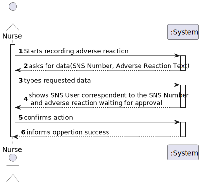
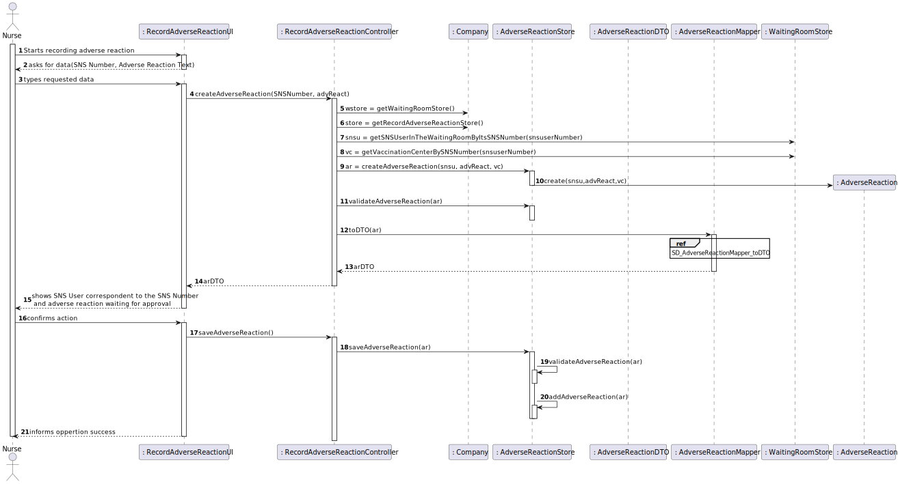

# US 007 - Nurse

## 1. Requirements Engineering

### 1.1. User Story Description

*As a Nurse, I intend to record adverse reactions of a SNS User.*

### 1.2. Customer Specifications and Clarifications 

**From the Specifications Document:**

> [...]If the nurse identifies any
adverse reactions during that recovery period, the nurse should record the adverse reactions in the
system.[...]
> 

**From the client clarifications:**

> **Question: "When recording adverse reactions, does the Nurse need to folllow a form? If so, what are its attributes?"** 
>
> **Answer: The nurse does not need to fill a form. The nurse only writes a text with at most 300 characters.**

### 1.3. Acceptance Criteria

 >**AC1: SNS User needs to have its arrival registered into the waiting room in order to record its Adverse Reaction.**

 >**AC2: Adverse Reaction text cannot surpass 300 characters.**

### 1.4. Found out Dependencies

*US 004, US 003*

### 1.5 Input and Output Data

**Input Data:**
* Typed Data:
    * SNS Number
    * Adverse Reaction Text
* Selected Data: n/a

**Output Data:**
* (In)Success of the operation

### 1.6. System Sequence Diagram (SSD)

### 1.7 Other Relevant Remarks

-

## 2. OO Analysis

### 2.1. Relevant Domain Model Excerpt 

### 2.2. Other Remarks

n/a

## 3. Design - User Story Realization 

### 3.1. Rationale

**The rationale grounds on the SSD interactions and the identified input/output data.**

| Interaction ID | Question: Which class is responsible for...                                                      | Answer                          | Justification (with patterns)                                                                                 |
|:---------------|:-------------------------------------------------------------------------------------------------|:--------------------------------|:--------------------------------------------------------------------------------------------------------------|
| Step 1  		     | 	... interacting with the actor?                                                                 | RecordAdverseReactionUI         | Pure Fabrication: there is no reason to assign this responsibility to any existing class in the Domain Model. |
| 			  		        | 	... coordinating the US?                                                                        | RecordAdverseReactionController | Controller                                                                                                    |
| 			  		        | 	... instantiating a new Adverse Reaction?                                                       | AdverseReactionStore            | Creator (Rule 1): Store has all SNS Users.                                                                    || 			  		        |
|                | ... knowing if the sns user is in the waiting room and what vaccination center is it associated? | WaitingRoomStore                | IE: WaitingRoomStore knows all SNS Users present in the waiting room of a given Vaccination Center.           |
| Step 2  		     | 							                                                                                          |                                 |                                                                                                               |
| Step 3  		     | 	...saving the inputted data?                                                                    | AdverseReaction                 | IE: object created in step 1 has its own data.                                                                |
| Step 4  		     | 	...knowing the Adverse Reaction categories to show?                                             | AdverseReactionDTO              | IE: AdverseReactionDTO defines the categories of the AdverseReaction to show.                                 |
| Step 5  		     | 	... saving the Adverse Reaction?                                                                | RecordAdverseReactionController | Controller: coordinates the user story so it has its trigger method to be activated by the UI.                |
| 			  		        | 	... validating the created Adverse Reaction (global validation)?                                | AdverseReactionStore            | IE: knows all SNS Users.                                                                                      | 
| 			  		        | 	... saving the created Adverse Reaction?                                                        | AdverseReactionStore            | IE: owns all SNS Users.                                                                                       | 
| Step 6 		      | 	... informing operation success?                                                                | RecordAdverseReactionUI         | IE: is responsible for user interactions.                                                                     | 

### Systematization ##

According to the taken rationale, the conceptual classes promoted to software classes are: 

 * Company
 * AdverseReaction

Other software classes (i.e. Pure Fabrication) identified: 

 * RecordAdverseReactionUI(Pure Fabrication)  
 * RecordAdverseReactionController(Controller)
 * AdverseReactionStore(Pure Fabrication/in favor of (HC/LC))
 * AdverseReactionDTO(Pure Fabrication)
 * AdverseReactionMapper(Pure Fabrication)

## 3.2. Sequence Diagram (SD)

Adverse Reaction recording SD

AdverseReactionMapper toDTO SD

## 3.3. Class Diagram (CD)

*In this section, it is suggested to present an UML static view representing the main domain related software classes that are involved in fulfilling the requirement as well as and their relations, attributes and methods.*

# 4. Tests 

    

# 5. Construction (Implementation)

# 6. Integration and Demo 

n/a

# 7. Observations

n/a

